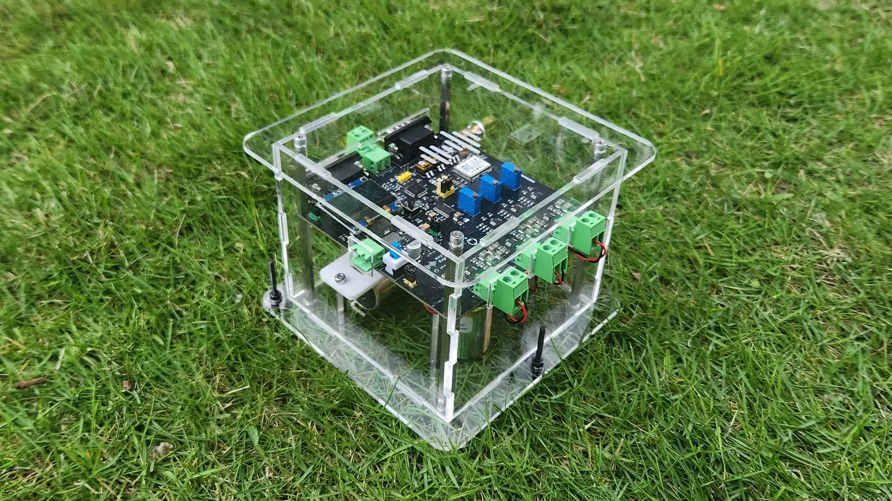

**AnyShake Explorer** is an open-source, professional-grade seismic monitoring system designed for researchers, engineers, educators, and enthusiasts. In a market dominated by expensive, closed-source “black boxes,” AnyShake Explorer offers transparency, affordability, and top-tier performance.

<!-- truncate -->

### What Makes AnyShake Explorer Special?

- **Fully Open Source** – Hardware schematics, firmware, and software are all available for inspection, customization, and community contribution
- **High Performance** – 32-bit geophone, 16-bit accelerometer data, real-time output, and support for MiniSEED, SAC, WAV, and SeedLink protocols
- **Low-frequency Mastery (2s period)** – Thanks to low-frequency compensation, Explorer can detect long-period seismic waves often missed by other open-source devices
- **Ultra Low Power** – Consumes just ~0.6 W, making it perfect for solar or battery-powered deployments
- **Built for Everyone** – Whether you're setting up a seismic station, monitoring building vibrations, or just curious about earth movements, it’s easy to use and powerful enough for professional research

### Why It Matters

We believe in **open science**. By making high-precision seismic monitoring accessible and affordable, we're empowering more people to explore, learn, and contribute to earth science.

### Get Involved

- **Campaign**: [crowdsupply.com/senseplex/anyshake-explorer](https://www.crowdsupply.com/senseplex/anyshake-explorer)
- **Website**: [anyshake.org](https://anyshake.org)
- **GitHub**: [github.com/anyshake](https://github.com/anyshake)
- **Discord**: [Join the community](https://discord.gg/PuK4Sb4Nr6)
- **X (Twitter)**: [@anyshake_org](https://x.com/anyshake_org)

_**[Back our campaign today](https://www.crowdsupply.com/senseplex/anyshake-explorer) and help usher in the future of accessible, precise, and truly open seismic monitoring**_

— The AnyShake Team
