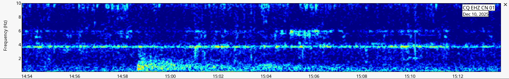
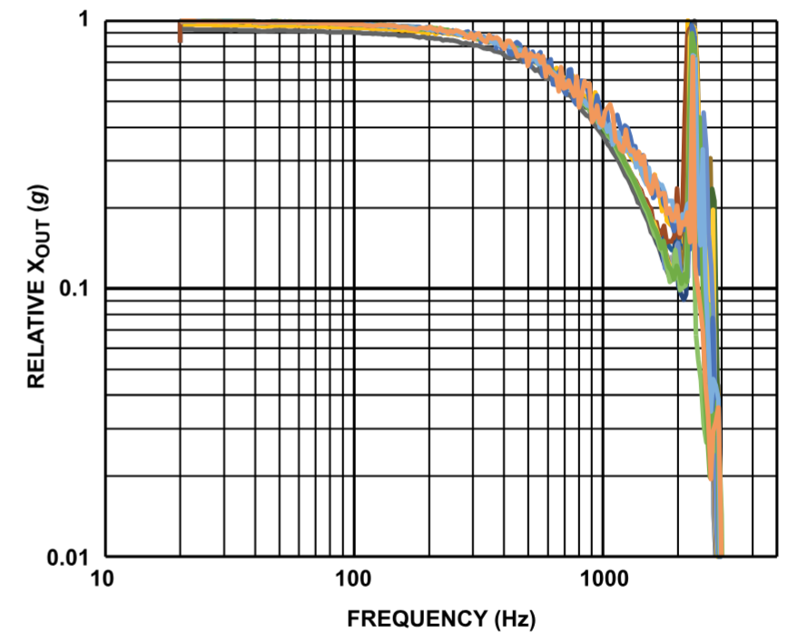
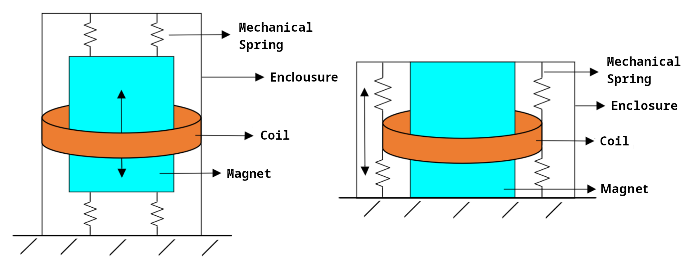
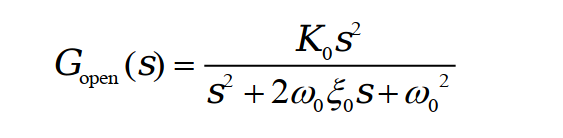
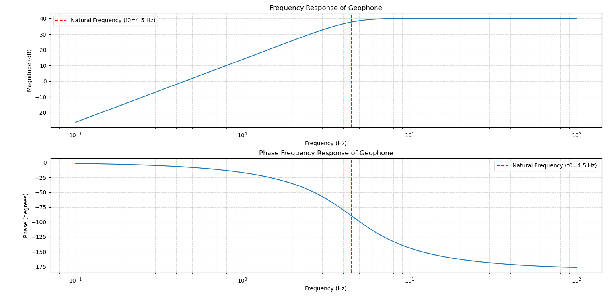
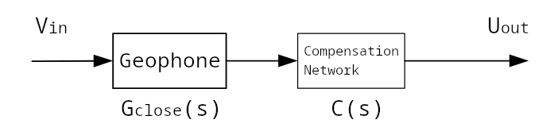
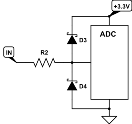
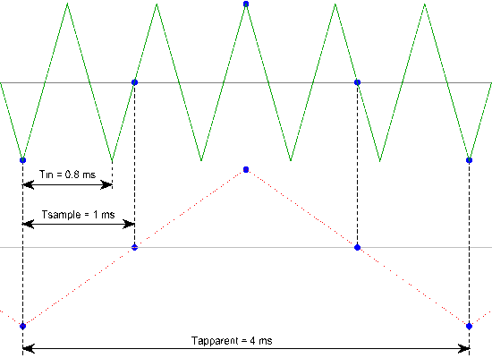

> For original English version, see _[What Seismograph Manufacturers Won’t Tell You - A Practical Guide to Efficient Teleseismic Monitoring on a Limited Budget](/blog/teleseismic-on-a-limited-budget)_

## 導入

遠地地震信号とは、数百から数千キロメートル離れた場所で発生した地震によって発生する地震波を指します。これらの信号を監視することで、地球の内部構造や地震の特徴といった貴重な地球物理学的情報が得られ、科学研究、教育、そして趣味のネットワークに役立ちます。

局所的な地震と比較して、遠地地震波は**周波数**がはるかに低く、典型的には**2Hz未満**（図1）であり、振幅も著しく小さい。例えば、アラスカの地震がフィリピンに到達する場合、その卓越した周波数成分は**1/fノイズが支配的な帯域**にあることが多く、有用な信号が容易に隠され、地震波の位相を確実に検出することが困難になる。

一方、**力平衡型加速度計 (FBA)** や **超広帯域 (VBB)** 地震計などの従来の地震計測機器は、優れた低周波応答と高い SNR を備えていますが、個人、学校、または小規模な研究グループにとってはコストが高すぎます。

低コストのセンサー、オープンソースハードウェア、そして安価なマイクロコントローラの登場により、**低コストの遠隔地震モニタリングが実現可能になりました**。このアプリケーションノートでは、センサーの選定、データ収集アーキテクチャ、コストパフォーマンスのトレードオフ、導入時の考慮事項など、予算の制約下で遠隔地震モニタリングシステムを実装する方法について説明します。

<!-- 切り捨て -->

## センサーの選択

遠地地震監視システムにおいて、センサーはデータ全体の品質と有用性を決定づける中核コンポーネントです。優れた遠地地震センサーは、周波数応答、ノイズ性能、ダイナミックレンジ、そして長期安定性といった要件を満たす必要があります。

[ADI の地震監視に関するドキュメント](https://www.analog.com/en/resources/analog-dialogue/articles/understanding-the-fundamentals-of-earthquake-signal-sensing-networks.html)と構造センシングでは、現代の地震システムは**コストとパフォーマンス**の間でバランスのとれた妥協点を見つける必要があり、意図されたアプリケーションに適したセンシング技術を採用する必要があることが強調されています。

このセクションでは、一般的に使用されているセンサーの種類（**MEMS 加速度計** と **地震計**）を比較し、特に遠地地震監視に関する技術的な推奨事項を示します。

### MEMS加速度計

MEMS加速度計は、微細加工された機械構造を用いて地面の動きを電気信号に変換します。携帯型加速度センサーや構造振動モニタリングに広く利用されています。典型的なデバイスは、薄いフレクシャで吊り下げられたシリコン製のプルーフマスで構成され、固定電極と差動コンデンサを形成します。プルーフマスの動きによって静電容量が変化し、それが加速度に比例した電圧に変換されます（図2）。

MEMS 加速度計の主な利点としては、コンパクトなサイズ、低消費電力、低コストのマイクロコントローラおよび SoC とのシームレスな統合などが挙げられます。

ほとんどのMEMS加速度計の周波数応答は、機械的共振周波数でカットオフするローパスフィルタに似ています。オフセットドリフトのため、MEMSデバイスは通常、**共振周波数に比較的近いが共振周波数より低い周波数で良好な性能を発揮し**、極低周波数帯域に向かうにつれて急速に性能が低下します（図3）。

低周波数では、MEMS加速度計は機械的摩擦、電荷トラッピング、および内部増幅器の低周波ドリフトに起因する**1/fノイズ**（フリッカーノイズ）を顕著に示します。周波数が低下するにつれて、ノイズ密度が増加します。動きがない場合でも、ランダムな低周波変動が実際の遠地地震の振幅に匹敵するように見えることがあります（図4）。

低周波 MEMS 出力は、さらに以下の影響を受けます。

- **センサー バイアス ドリフト**: 長期的なベースライン ドリフトは 1/f ノイズのように動作し、弱い信号の検出能力が低下します。
- **温度誘起オフセットドリフト**: 温度の変動により、時間の経過とともにベースラインがシフトし、遠地地震信号の振幅を超えることがよくあります。

1/fノイズ、オフセットドリフト、温度の影響が組み合わさり、遠地地震帯域（< 2 Hz）におけるMEMSのSNRは著しく制限されます。微弱なP波、S波、表面波は検出されない可能性があります。ソフトウェアフィルタリング、数値積分、温度補正を用いても、正確な速度または変位の再構築は依然として困難です。

これらの問題に対処するため、**EPSON**などのメーカーは、超低ノイズの水晶共振型MEMS加速度計（[link](https://www.epsondevice.com/sensing/en/products/accelerometer/feature/)）を発表しました。これらの加速度計は安定性が大幅に向上していますが、標準的な低ノイズMEMSデバイスに比べて数百倍も高価です。そのため、MEMS加速度計は低コストの構造監視や局所的な地震検知には適していますが、高品質の遠地地震監視のための主要センサーとしては適していません。

### 受振器

ジオフォンは、質量バネとコイル磁石の構造を用いて地盤の振動を電気信号に変換する速度センサーです。速度を直接出力するため、地震位相解析における積分処理は不要です。

内部トポロジーに基づいて、受振器は可動コイル型と可動磁石型に分類されます（図5）。

これらは同様に動作しますが、どのコンポーネントが移動するかが異なります。

- **可動コイル**: ハウジングと永久磁石は固定されたままで、吊り下げられた質量に取り付けられたコイルが動きます。
- **可動磁石**: ハウジングとコイルアセンブリは固定されたままですが、永久磁石は吊り下げられた質量に取り付けられています。

動作原理はほぼ同じで全体的な性能も同等ですが、可動コイル設計の方が製造が容易であるため、地震探査や遠地地震監視でより広く使用されています。

受振器の伝達関数は次のように表すことができます。

どこ：

- **K₀** — オープンループ感度（V/m/s）
- **ω₀** — 固有角周波数 (rad/s)、ω₀ = 2πf₀
- **f₀** — 共振周波数
- **ξ₀** — 減衰比

次のパラメータを持つ受振器を想定します。

- f₀ = 4.5 Hz
- K₀ = 100 V/m/s
- ξ₀ = 0.65

シミュレートされた周波数応答を図6に示します。

図に示すように、共振周波数を超えると速度応答はほぼ平坦になりますが、共振周波数未満では出力は急速に低下します。

ほとんどの低コストアプリケーションでは、**4.5 Hz のジオフォン** が最適な選択肢です（図7）。低周波ジオフォン（例：2 Hz）は約10倍のコストがかかりますが、高周波ジオフォン（例：10 Hz）は低周波応答が悪く、遠地地震のモニタリングには適していません。

帯域幅を拡張し、低周波応答を改善するために、外部補償ネットワークを用いて受振器の伝達関数を再構成することが一般的です。いくつかのアプローチがあります。

- **パッシブサーボ補償**：この方法では、ジオフォンの出力と並列に配置されたRCネットワークを使用して、移動システムの有効質量を増加させ、共振周波数を低下させます（図8）。ただし、以下の点に注意してください。

- 結果として得られる減衰比は**1より大きくなり**、最適値（≈0.707）から外れます。
- 感度が大幅に低下します。
- 大型コンデンサは温度安定性が低いことが多く、全体的なパフォーマンスが低下します。

- **フィードバック補償**：制御された電流がジオフォンコイルに注入されます。この電流は、吊り下げられた質量に補正力を発生させます。正帰還フィルタ（通常は積分型）は、ジオフォン出力からこの電流を導出します（図9）。これにより、低周波の質量運動が効果的に増幅され、帯域幅が拡張されます。ただし、以下の点に留意してください。

- 安定した正帰還ループを設計するのは**難しい**です。
- 位相マージンとループ安定性を厳密に維持する必要があります。

- **極零点補正**（推奨）：極零点補正では、ジオフォンに直列に補正ネットワークを挿入し、補正ネットワークの零点が元のセンサーの極を打ち消すようにします。こうすることで、修正されたシステムの極は外部ネットワークの極になります（図10）。

利点:

- 受振器の内部機械特性は**変更されない**
- 制御された予測可能な周波数シェーピングを提供
- **アナログ回路またはデジタルフィルタ**で実装可能
- 実用的な補償方法の中で**最も低コスト**

このアプローチは、低コストの地震計測機器にとって最も効果的な技術として広く認められています。

## データ取得スキーム

遠地地震監視において、データ収集は極めて重要です。その目的は、受振器からのミリボルトレベルのアナログ信号を、**歪みや大きなノイズを加えることなく、かつセンサー間の位相整合のための正確なタイミングで**デジタルストリームに変換することです。

3つの主要コンポーネント:

1. **信号の前処理**
2. **ADC変換**
3. **データの取り扱いと転送**

### 入力電圧クランプ

クランプは入力電圧をADCの安全範囲に制限します。例えば、±10VのADC範囲では、クランプはダイオードベースの構造を用いてオーバーレンジの発生を防ぎます（図11）。

### プリアンプ

低ノイズオペアンプは、速度信号をADCのダイナミックレンジに合わせて増幅します。ADA4522やADA4528（図12）などのゼロドリフトアンプは、マイクロボルトレベルのオフセットと極めて低いドリフトおよび1/fノイズを実現しており、低周波で微弱な信号に最適です。

低コストの設計では、外部アンプを省略して内部 ADC PGA に置き換えることができますが、内部 PGA ではノイズが高く、入力インピーダンスが制限されます。

### アンチエイリアシングフィルタ

アンチエイリアシングフィルタは、信号がADCに入る前にナイキスト周波数を超える周波数成分を抑制するために使用されます。適切なフィルタリングが行われないと、サンプリング中に高周波ノイズが通過帯域に折り返され、記録データに不可逆的な汚染が生じます（図13参照）。

適切に設計されたアンチエイリアシング フィルタは、ADC がクリーンな信号を受信するかどうかを直接決定し、結果としてシステムが低周波の遠地地震イベントを確実に検出できるかどうかを決定するため、アナログ フロントエンドの重要な部分です。

基本的に、アンチエイリアシングフィルタは**アナログローパスフィルタ**であり、パッシブ回路またはアクティブ回路を使用して実装できます。**デジタルフィルタリングはサンプリング後に行われるため、エイリアシングを防ぐことができないため、**デジタルフィルタリングを代替することはできません\*\*。

実際の設計では、適切なロールオフを確保するために、カットオフ周波数は通常、サンプリング周波数の半分よりわずかに低い値に設定されます。このフィルタの品質は、ADCの入力整合性と、低周波帯域における遠地地震信号を分離するシステムの能力に影響を与える最も重要な要因の一つです。

### アナログ-デジタルコンバーター（ADC）

ADCは、ジオフォンからの極めて微弱なアナログ信号をデジタルサンプルに変換します。データ収集チェーンの中で最も重要かつコストのかかるコンポーネントであるADCの選定においては、性能、安定性、そして供給体制のバランスが重要です。

地震監視アプリケーションの場合、必須の ADC 仕様は次のとおりです。

- **分解能:** 検出可能な信号の最小変化を決定します。地震計では通常、24ビットのコンバータが使用されます。
- **有効ビット数 (ENOB):** 公称解像度よりも意味があり、実際の精度を反映します。
- **ダイナミック レンジ:** 非常に弱い信号と非常に強い信号を同時に測定できる能力を示します。
- **入力換算ノイズ:** 地震監視にとって最も重要な指標であり、検出可能な最小信号を設定します。
- **サンプリング レート:** 遠地地震のモニタリングには通常 50～200 SPS が必要です。ADC はこれらのレートで安定した動作をサポートする必要があります。
- **入力フロントエンド アーキテクチャ:** 差動入力、内部 PGA 構造、基準電圧設計など。
- **温度ドリフトと長期安定性:** 長期にわたる継続的な記録に重要です。
- **製品ライフサイクル (EoL ステータス):** 寿命が近づいている、または寿命が近いデバイスは使用しないでください。

**デルタシグマ (Δ-Σ)** ADC は、次のような理由から地震波および音声帯域のアプリケーションに最適です。

- 非常に高い解像度（通常は24ビット）
- 高いオーバーサンプリング比
- 極めて低い入力ノイズ
- 広いダイナミックレンジ

弱点は帯域幅が限られているため、高速サンプリングには適していません。代表的な例としては、以下のものがあります。

- ADS1256
- ADS127L01
- AD7768シリーズ
- LTC2500シリーズ

**SAR（逐次近似）** ADCは高速アプリケーションに適しています。ただし、低周波の微小信号測定では、SARのノイズとダイナミックレンジは一般的にΔ-Σコンバータよりも劣ります。SARデバイスは、高周波地震探査やSHMアプリケーションにも使用できます。一般的な例としては、MCP3208やLTC1867などが挙げられます。

低コストの地震アプリケーションの場合、適切な Δ-Σ ADC は次の要件を満たす必要があります。

- 入力ノイズ < **500 nV/√Hz** (0.1～10 Hz 帯域)
- 24ビット以上の解像度
- 真のデルタシグマアーキテクチャ

信頼性の高い低価格モデルには次のようなものがあります。

- **ADS1256**
- **ADS131M0x ファミリー**
- **ADS131E0x ファミリー**

これらのデバイスは、安定した供給と強力なコミュニティサポートを提供しながら、遠地地震監視に十分なノイズ性能、ダイナミック レンジ、およびアーキテクチャの堅牢性を備えています。

一方、**ADS1115**や**BluePill**などのボードに内蔵されている12ビットADCは、ノイズが非常に高く、ダイナミックレンジが不十分であるため、遠地地震アプリケーションには適していません。汎用センシングにのみ適しています。

よりハイエンドの地震探査性能を実現するには、**ADS1281 / ADS1285** などの探査グレード専用ADCが優れたノイズとダイナミックレンジを提供しますが、コストが高く、設計が複雑になります。これらは本ドキュメントの範囲外です。

### マイクロコントローラユニット (MCU)

MCUは、データ取得、バッファリング、タイミング同期、通信、ADCとのインターフェースといった重要なシステム機能を担います。継続的な長期地震監視には、強力なリアルタイム性能を備えた信頼性の高いMCUアーキテクチャが必要です。

重要な選択基準は次のとおりです。

- **信頼性と24時間365日の安定性:** さまざまな条件下で継続的に動作する必要があります。
- **適切な処理能力:** 持続的な ADC データ ストリームと光フィルタリング/パッケージングを確実に処理する必要があります。
- **安定した周辺インターフェース:** 特に SPI、UART、タイマー、DMA。
- **正確な時間同期のサポート:** GNSS 1PPS アライメントに必要です。
- **強力な開発エコシステム:** 包括的な SDK、ドキュメント、および例。

次のようなワイヤレス インターフェース:

- Wi-Fi
- BLE
- NB-IoT
- ジグビー

一般的には避けるべきです。電磁ノイズが発生し、地震波帯域（特に1～20Hz）を直接汚染します。一部のメーカーは、精密センシング中に無線通信を有効にしないよう明確に警告しています。

したがって、有線通信が強く推奨されます。

- **UART / RS-232 / RS-485:** 低コスト、ノイズ耐性、ポイントツーポイント リンクに信頼性があります。
- **イーサネット:** サーバーまたは SBC への長距離、高信頼性データ ストリーミングに適しています。

可能な限り、**DMA サポート** を備えた MCU を選択してください。DMA により、CPU の介入なしに ADC からメモリへの連続的なデータ転送が可能になり、ジッタが低減され、サンプルの損失を防ぐことができます。これは、地震記録における位相精度と長期的な連続性を維持するために重要です。

**推奨MCUファミリー: STM32**

- Δ-Σ ADCデータストリームに最適な安定したSPI + DMAアーキテクチャ
- 高精度なGNSS-1PPS同期のための豊富なタイマー
- 成熟したエコシステムと優れた長期サポート

人気のモデルには、低コストで堅牢なパフォーマンスを提供する **STM32F103、STM32F303、STM32F411** などがあります。

**ESP32 / RP2040** は趣味のプロジェクトには魅力的ですが、高品質の遠地地震監視には推奨されません。

- 深刻なWi-Fi / PLLノイズ
- 不安定なDMAシステム
- 高いクロックジッタ
- 強い温度ドリフト
- 長期信頼性が限られている

使用する場合、ワイヤレス機能を完全に無効にする必要があります。

Raspberry Pi などの**シングルボードコンピューター (SBC)** は、次の理由により ADC サンプリングを直接駆動すべきではありません。

- Linuxは非リアルタイム（不確定なスケジュール）
- SPIタイミングによりジッタが発生したり、フレームがドロップされる可能性があります
- ハードリアルタイムサンプリングは保証されない

SBC は、視覚化やネットワーク化のためのダウンストリーム プロセッサとしては適していますが、フロントエンドのサンプリングには適していません。

## AnyShakeプロジェクト: オープンソースの低コスト地震監視

AnyShakeプロジェクトは、**AnyShake Explorer**ハードウェアプラットフォームと**AnyShake Observer**クロスプラットフォームソフトウェアで構成される、完全にオープンソースの地震および振動モニタリングシステムです。その目標は、研究レベルの信号品質を大幅に低コストで提供し、従来の高価なクローズドソース機器の領域を超えた地震モニタリングを実現することです。

このシステムは、以下を含めて完全にオープンです。

- 回路図とPCB設計
- ファームウェアとツールチェーン
- 完全なソフトウェアソースコード
- 可視化、フィルタリング、スペクトル分析のためのアルゴリズム

研究者、教育者、愛好家は、リアルタイムの地震監視システムを簡単に構築したり、より幅広い振動アプリケーション向けに設計を適応させたりすることができます。

### E-D001: 超低コストのエントリーレベルプラットフォーム

予算が限られていて、AnyShake をすぐに使いたいユーザー向けに、**E-D001** は、手頃な価格と再現性を重視して最適化された、最小限でアクセスしやすいハードウェア設計を提供します。

- DIY費用は**40ドル**以下
- 基本的な低周波受振器の拡張を可能にするデジタル極零補正
- SeisComPと完全に互換性があります
- リアルタイム3軸加速度計の取得と可視化
- プラグアンドプレイのセットアップで、ハードウェアの専門知識は必要ありません

AnyShakeシリーズ全体よりもノイズフロアとダイナミックレンジは低いものの、E-D001は教育、デモンストレーション、プロトタイピング、趣味の実験に最適です。より高品位な遠地地震記録が必要な場合は、ソフトウェアを変更することなく**E-C111G**プラットフォームにシームレスにアップグレードできます。

ハードウェア リソース:
**github.com/anyshake/explorer/tree/v1**

### E-C111G: プロフェッショナルアプリケーション向け高性能プラットフォーム

**E-C111G**プラットフォームは、研究グレードおよび長期モニタリングアプリケーションを対象としています。エントリーレベルのE-D001と比較して、アナログフロントエンド設計、ノイズ性能、タイミング精度、そしてシステム全体のアーキテクチャが大幅に向上しています。主な特長は以下のとおりです。

- 超低ノイズ差動入力段を備えたハードウェアポールゼロ補償
- 一般的な趣味用機器よりもはるかに低いノイズフロア
- 遠地地震信号、微小地震、周囲騒音、構造応答に適しています
- Stratum-1機能を備えたGNSS 1PPSタイミング
- RS-232 / RS-485を含む複数の有線通信オプション
- ジッターと干渉を最小限に抑え、長期安定性を実現する設計

高性能と低コストのバランスが取れた E-C111G は、大学の研究室、研究機関、エンジニアリング監視、コミュニティ ネットワーク、オープンソースの地震学愛好家に最適です。

ハードウェア リソース:
**github.com/anyshake/explorer/tree/master**

## 結論

従来の地震モニタリングは、ノイズ性能、ダイナミックレンジ、長期安定性、そして正確なタイミングに対する厳しい要件のため、高価で密閉型のプロ仕様の機器に依存してきました。その結果、研究用途と教育用途の両方において、大きなコスト障壁に直面してきました。

AnyShakeプロジェクトは、センサーやアナログフロントエンド設計からADCアーキテクチャ、通信プロトコル、波形可視化に至るまで、エンドツーエンドのハードウェアとソフトウェアのソリューションを提供することで、実用的なオープンソースの代替手段を提供します。この完全にオープンなアプローチにより、ユーザーは高価な機器を必要とせずに、再現性と保守性に優れた研究レベルの地震監視システムを構築できます。

AnyShake は、経済的および技術的なハードルを下げることで、教育機関、研究グループ、コミュニティ愛好家が地震学や構造のモニタリングに参加できるようにし、より幅広い参加を促進し、協力的でスケーラブルかつ革新的なモニタリング ネットワークを実現します。
