:::info
This tutorial applies to AnyShake Explorer **E-C121G** as well.
:::

ADC calibration ensures the accuracy and linearity of analog-to-digital conversion, which is essential for precise seismic signal acquisition. This tutorial will guide you through the process of performing ADC calibration on the AnyShake Explorer **E-C111G**.

At present, the AnyShake Explorer supports **offset calibration**, which corrects for small voltage shifts caused by OP-AMPs when the input signal is zero. The calibration data is stored in an external EEPROM chip, ensuring persistence even after firmware upgrades.

The AnyShake team provides a dedicated firmware project for ADC calibration: [AnyShake Trimbit](https://github.com/anyshake/trimbit). To perform calibration:

1. Flash the Trimbit firmware to your AnyShake Explorer E-C111G device.
2. Follow the on-screen instructions displayed on the on-board OLED screen.
3. Once calibration is complete, re-flash the latest official firmware from the [AnyShake Explorer repository](https://github.com/anyshake/explorer).

This simple process ensures that your device operates with optimal ADC accuracy.

:::info
However, for certain early hardware revisions of the E-C111G and E-C121G, ADC calibration was performed using the on-board trimpot. If you are using one of these earlier versions, this calibration procedure is **not required**.

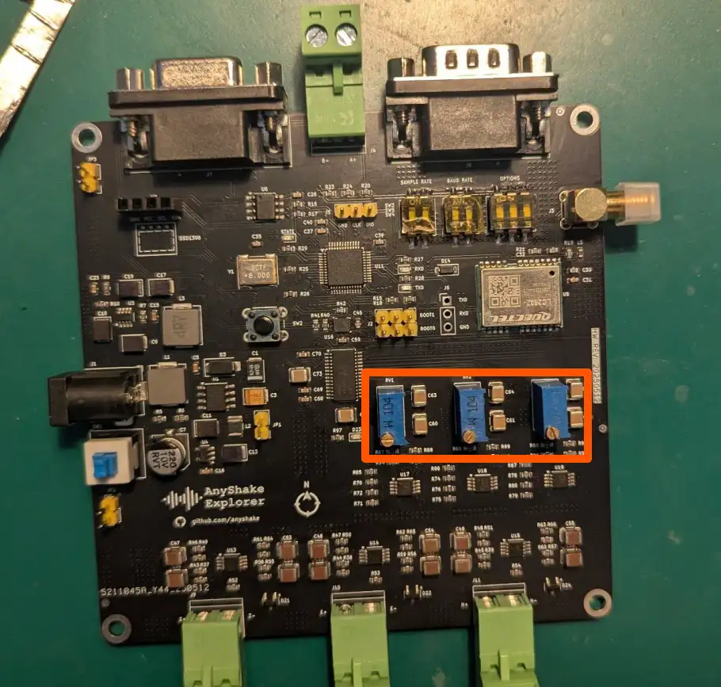
:::

## Before Getting Started

### Setup Development Environment

Before proceeding with ADC calibration, please follow the steps outlined in the [Firmware Upgrade](firmware-upgrade) guide to set up your development environment — up to and including the [Setup PlatformIO](firmware-upgrade#setup-platformio) section.

This ensures that all necessary tools (such as PlatformIO, Python, and Visual Studio Code) are correctly installed and configured before flashing the calibration firmware.

### Prepare Shorting Terminals for Calibration

For proper offset calibration, each analog input channel must be shorted to ground. To simplify this process, we recommend preparing shorting terminals by connecting the two sockets of each input terminal together using a short wire or jumper.

You can easily create these by:

- Taking a standard terminal block or plug compatible with the device,
- Inserting a short wire to connect the positive and negative pins,
- Securing the wire firmly using the terminal screws.

These modified plugs allow you to quickly and reliably short each channel during calibration.

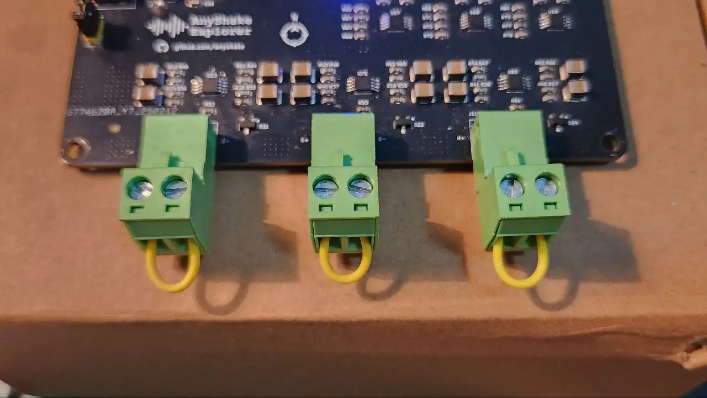

## Get Trimbit Firmware

The ADC calibration firmware is available in the [AnyShake Trimbit](https://github.com/anyshake/trimbit) repository.

To get source files, you need to clone the repository with `git`:

```bash
$ git clone --depth 1 https://github.com/anyshake/trimbit
```

Or get the latest project files using the following direct link, after downloading, extract the archive.

- [github.com/anyshake/trimbit/archive/refs/heads/master.zip](https://github.com/anyshake/trimbit/archive/refs/heads/master.zip)
- [github.com/anyshake/trimbit/archive/refs/heads/master.tar.gz](https://github.com/anyshake/trimbit/archive/refs/heads/master.tar.gz)

## Open Firmware Project

1. Press `Ctrl + K, O` (or `Cmd + K, O` on macOS)
2. Select the trimbit firmware folder

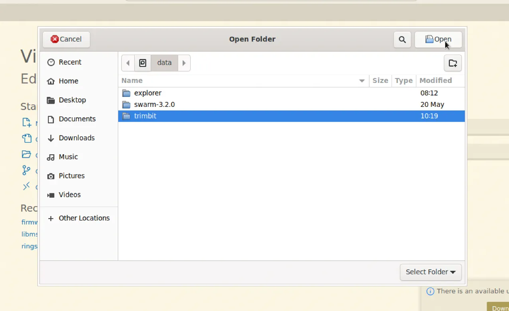

You should see the `platformio.ini` file in the root of the project. PlatformIO will automatically initialize the environment.

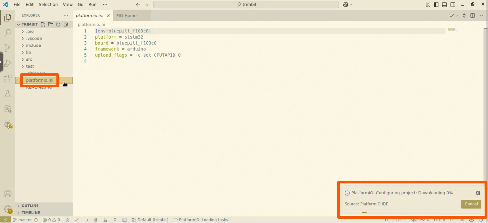

## Build and Upload

Click the **Upload** button in the PlatformIO toolbar to compile and flash the firmware.

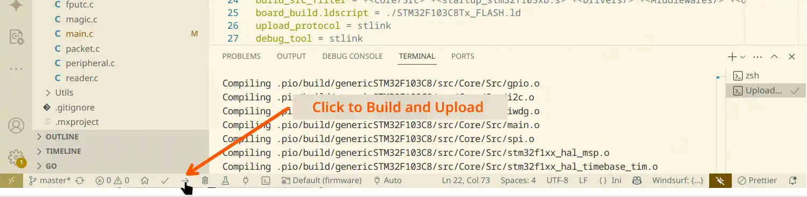

It usually takes a while to build firmware and upload to the device. If successful, you’ll see a confirmation message:

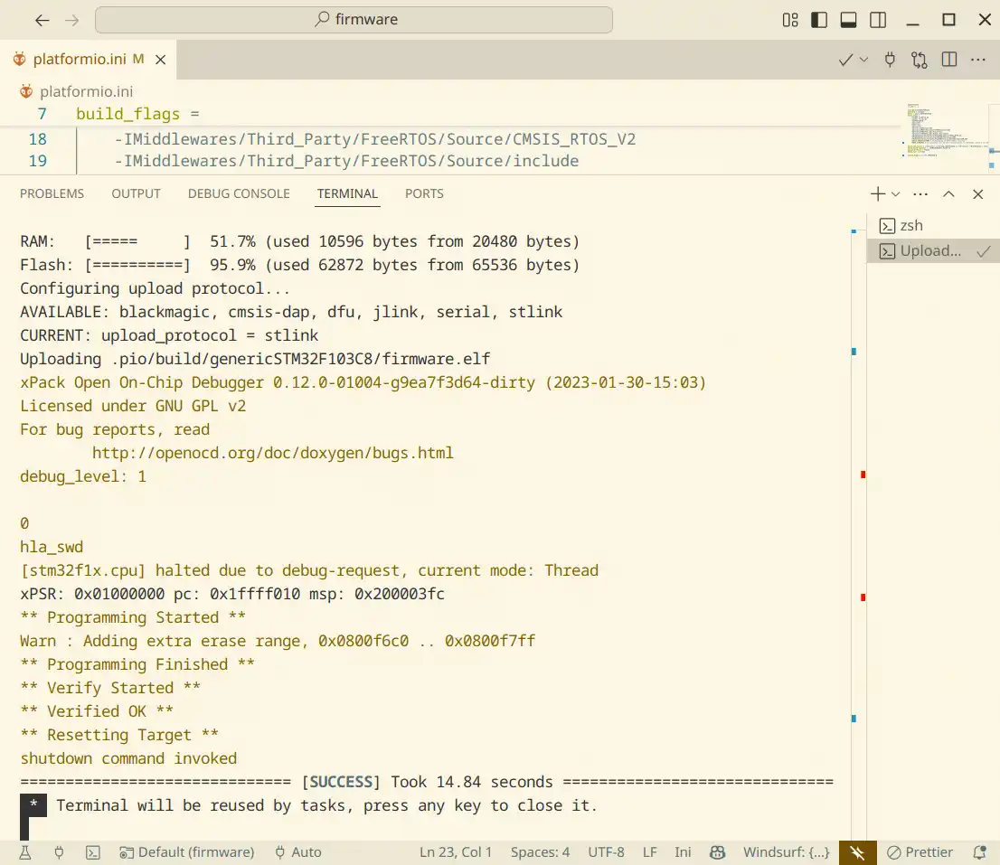

## Enter Calibration Mode

To begin the calibration process, press the **RESET** button, this will restart the device and automatically enter calibration mode.

If calibration data already exists in the external EEPROM chip, a warning message will appear on the OLED screen for up to 5 seconds. After this countdown, the device will proceed to the next step.

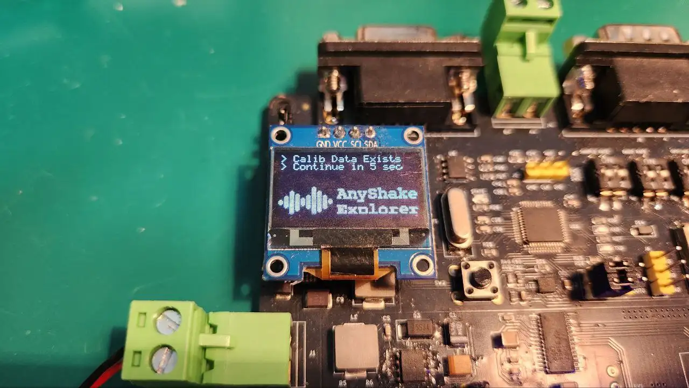

:::info
No existing data will be modified until you explicitly confirm calibration at the final step. It is safe to proceed without worrying about accidental data loss.
:::

After the warning message disappears, move the **BOOT1** jumper cap to the **right side** to begin the calibration sequence. The device will enter next step, where calibration is performed **per channel**, controlled via the **OPTIONS DIP switch**.

Each bit of the OPTIONS switch corresponds to one ADC channel. To initiate calibration:

1. **Set all DIP switch positions to HIGH (ON)** — this signals the firmware to begin a fresh calibration cycle for all channels.
2. Once this is detected, the firmware will start reading ADC data and begin offset calibration on the **first channel**.

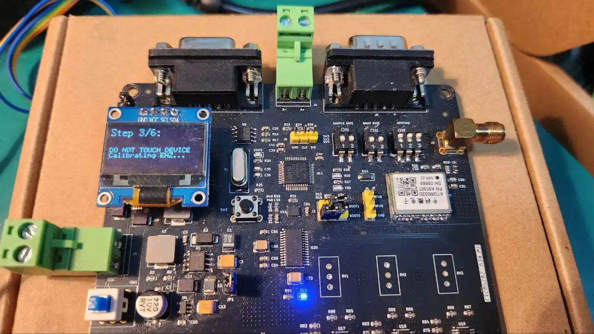

When calibration for a channel is complete, **flip the corresponding DIP switch bit to LOW (OFF)**, this tells the firmware to mark the channel as done and automatically proceed to the **next bit still set to HIGH**.

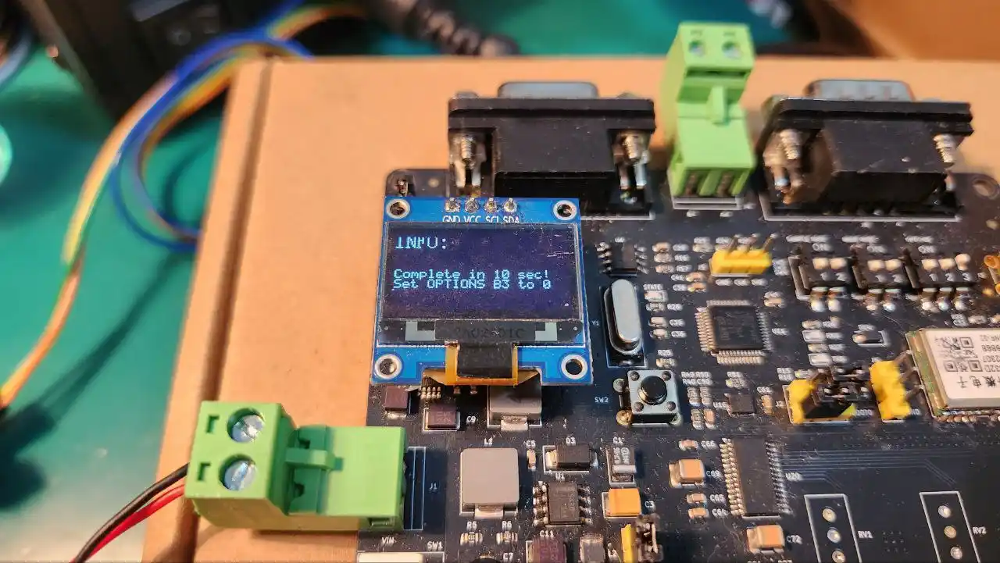

Repeat this process for each remaining channel until all DIP bits are set to LOW. This design allows you to manually control which channels are calibrated and in what order, while still providing a guided and semi-automated process.

Once all DIP bits have been toggled LOW (all channels calibrated), the system will automatically proceed to the final confirmation step.

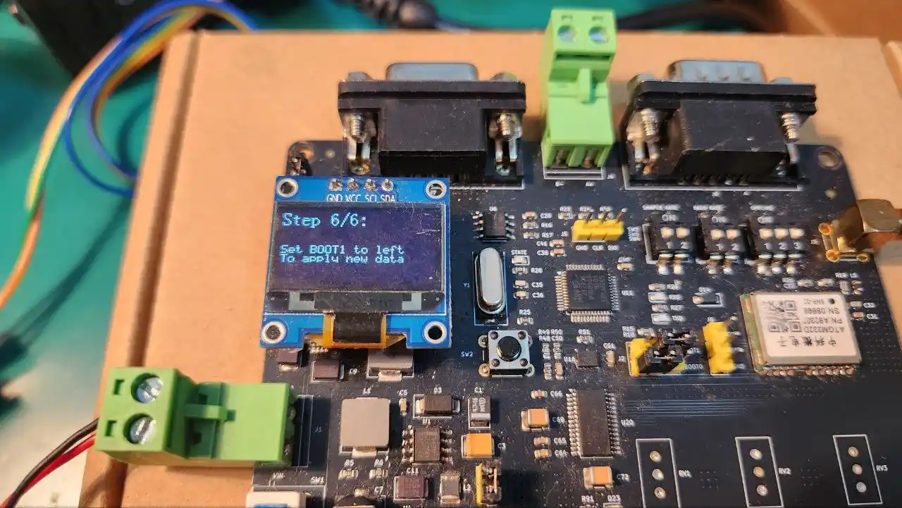

Set the **BOOT1** jumper cap to the **left side** to apply the changes and exit calibration mode. The OLED screen will display a confirmation message, and the **state LED** will begin blinking to indicate that calibration has been successfully completed.

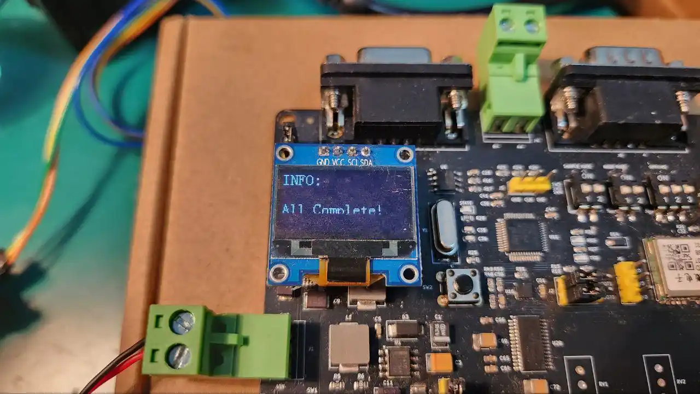

You can now power-cycle the device or flash the main firmware to resume normal operation.
