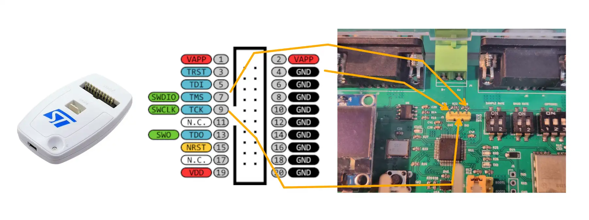

:::info
This tutorial applies to AnyShake Explorer **E-C121G** as well.
:::

This tutorial will guide you through the process of upgrading the firmware on the AnyShake Explorer **E-C111G**.

## Before Upgrading

The E-C111G is based on the ARM Cortex-M3 core. The upgrade process is usually done via an **SWD interface**. To upgrade the firmware, you need a **debugger** that supports SWD, such as **ST-Link** or **J-Link**.

In this tutorial, we use the official **ST-Link V2** for demonstration purposes.

:::tip
Third-party programmers that are **compatible with ST-Link V2** are also supported. These alternatives are often more affordable and work reliably with AnyShake Explorer E-C111G.
:::

## Connect E-C111G SWD Interface to PC

Dissamble the E-C111G enclosure and connect the SWD pins to your PC using ST-Link V2, connect the pins as follows:

| ST-Link V2 Pin | E-C111G Pin |
| -------------- | ----------- |
| Pin 4 (GND)    | GND         |
| Pin 7 (SWDIO)  | DIO         |
| Pin 9 (SWCLK)  | CLK         |




:::danger Caution
The SWD interface is **not electrically isolated**. Use caution when connecting to a powered system to avoid potential damage to your programmer or the device.
:::

## Install Driver for Programmer

On **Linux** systems, no additional driver installation is required. ST-Link programmers are supported through the standard `libusb` interface.

On **Windows**, you need to manually install the ST-Link USB driver. You can download the latest version from the [STMicroelectronics website](https://www.st.com/en/development-tools/stsw-link009.html).

After installing the driver, open **Device Manager** and check under **Universal Serial Bus Devices**.


:::tip
On Linux (e.g. Debian) systems, if you have `stlink-tools` package installed, you can use the `st-info` command to check if MCU is recognized by the programmer. For example:

```bash
$ st-info --probe
```

Typical output:

```
Found 1 stlink programmers
  version:    V2J29S7
  serial:     ************************
  flash:      131072 (pagesize: 1024)
  sram:       20480
  chipid:     0x410
  dev-type:   STM32F1xx_MD
```

With non-zero chipid and dev-type in the output, which indicates that the device has been successfully recognized by the programmer.
:::

## Setup PlatformIO

[PlatformIO](https://platformio.org/) is an open-source embedded development environment used to build and upload firmware. To install PlatformIO, you need install [Python](https://www.python.org/) and [Visual Studio Code](https://code.visualstudio.com/) first.

After installing, you can open Visual Studio Code and click **Extensions**, search to install "PlatformIO" extension.


It usually takes a few minutes to install the extension. Restart Viaual Studio Code after PlatformIO installation for the extension to initialize properly.

## Get Latest Firmware

The firmware source code for E-C111G is located in the default `master` branch of the [AnyShake Explorer GitHub repository](https://github.com/anyshake/explorer), under the `firmware/` directory.

To get source files, you need to clone the repository and checkout the corresponding branch.

If you have `git` installed, you can use the following command to clone the repository:

```bash
$ git clone --depth 1 https://github.com/anyshake/explorer
```

Or get the latest project files using the following direct link, after downloading, extract the archive and locate the `firmware` directory.

- [github.com/anyshake/explorer/archive/refs/heads/master.zip](https://github.com/anyshake/explorer/archive/refs/heads/master.zip)
- [github.com/anyshake/explorer/archive/refs/heads/master.tar.gz](https://github.com/anyshake/explorer/archive/refs/heads/master.tar.gz)

## Open Firmware Project

1. Press `Ctrl + K, O` (or `Cmd + K, O` on macOS)
2. Select the `firmware` folder inside the repository


You should see the `platformio.ini` file in the root of the project. PlatformIO will automatically initialize the environment.


## Customize Build Settings

Open the `platformio.ini` file and customize the settings according to your needs. There are a few options to customize:

### GNSS_BAUDRATE

The `GNSS_BAUDRATE` macro controls the baud rate of the on-board GNSS module. By default, it is set to `9600`, which is compatible with most GNSS modules. However, some modules may require a different baud rate for proper communication.

Below is a reference table listing common GNSS module models and their corresponding recommended baud rates:

| Manufacturer | Model        | Baud Rate (bps) |
| ------------ | ------------ | --------------- |
| ZHONGKEWEI   | ATGM332D     | `9600`          |
| Allystar     | TAU1114      | `9600`          |
| Quectel      | LC260Z       | `115200`        |
| u-blox       | MAX-M10S-00B | `38400`         |

### GNSS_MODEL

The `GNSS_MODEL` macro controls the GNSS module that is used in the firmware. It can be set to one of the following values:

- `GENERIC`: Generic GNSS module (for example, U-blox MAX-M10S-00B)
- `QUECTEL_LC260Z`: Quectel LC260Z GNSS module
- `QUECTEL_LC261Z`: Quectel LC261Z GNSS module
- `QUECTEL_LC760Z`: Quectel LC760Z GNSS module
- `QUECTEL_LC761Z`: Quectel LC761Z GNSS module
- `ZHONGKEWEI_ATGM332D`: Zhongkewei ATGM332D GNSS module
- `ZHONGKEWEI_ATGM336H`: Zhongkewei ATGM336H GNSS module
- `QUECTEL_L26K`: Quectel L26K GNSS module
- `QUECTEL_L76K`: Quectel L76K GNSS module
- `ALLYSTAR_TAU812S`: Allystar TAU812S GNSS module
- `ALLYSTAR_TAU1113`: Allystar TAU1113 GNSS module
- `ALYSTAR_TAU1114`: Allystar TAU1114 GNSS module

### DEVICE_MODEL

The `DEVICE_MODEL` macro specifies the target device model used by the firmware. Valid values are:

- `E-C111G`
- `E-C121G`

### HARDWARE_REV

The `HARDWARE_REV` macro specifies the hardware revision of the device.
It is represented as a date code corresponding to the current hardware revision and can be found printed on the front side of the PCB.

## Build and Upload

Click the **Upload** button in the PlatformIO toolbar to compile and flash the firmware.


It usually takes a while to build firmware and upload to the device. If successful, you’ll see a confirmation message:


## After Flashing

Remove the programmer from the E-C111G and reset the device by pressing the **RESET** button.

Your device is now running the updated firmware and ready for use!
