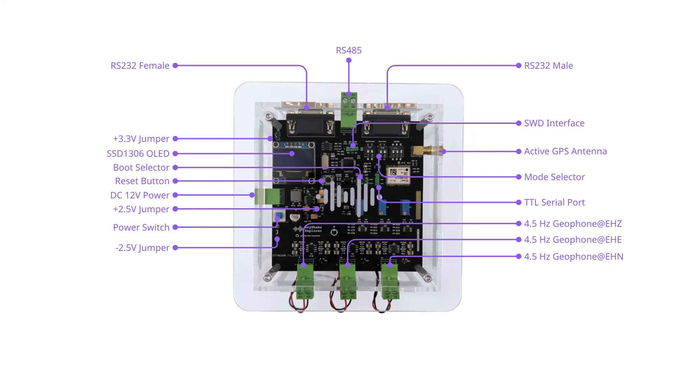
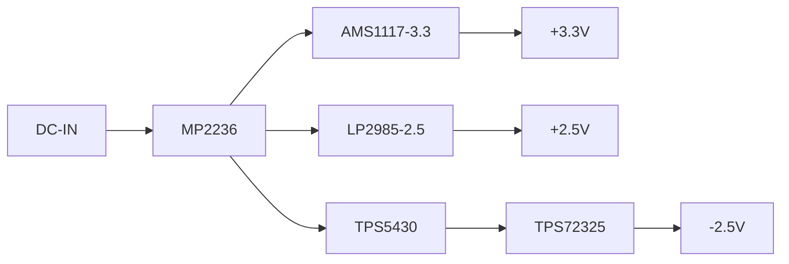
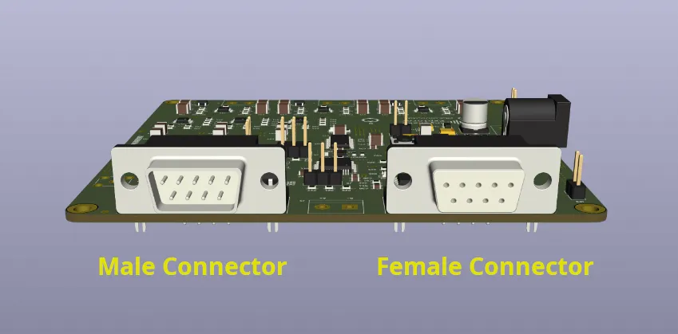
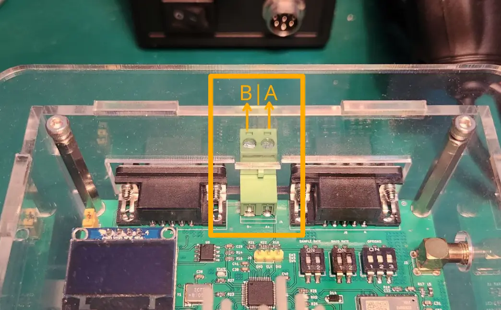
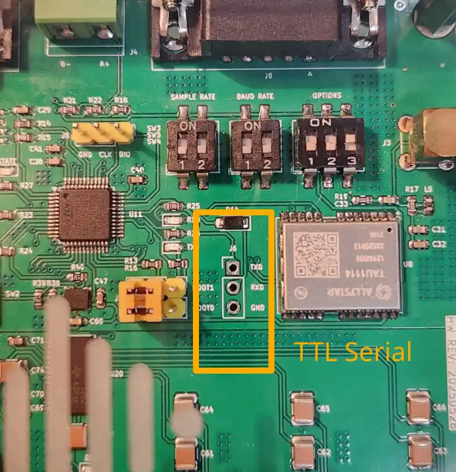
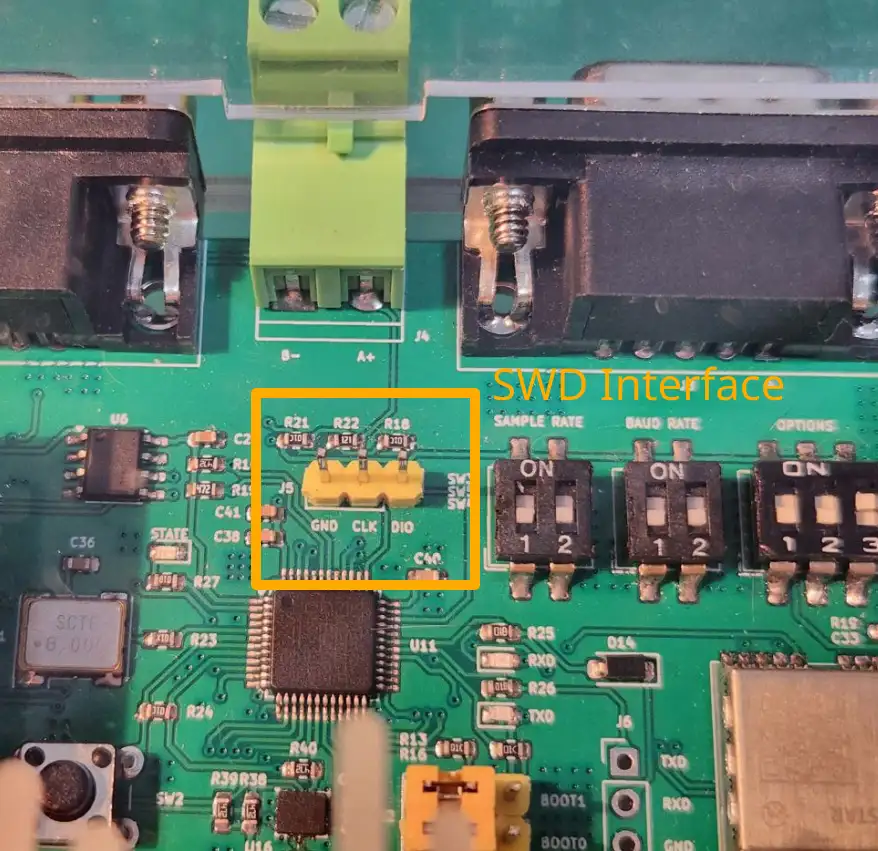
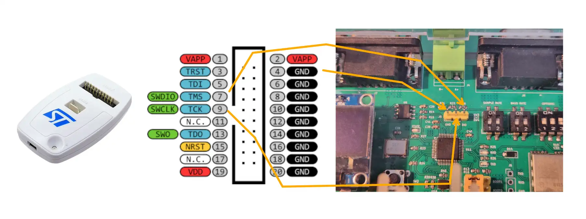
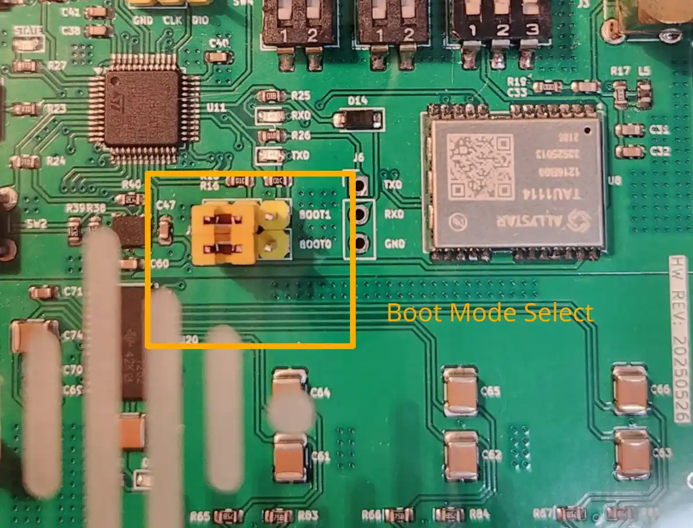
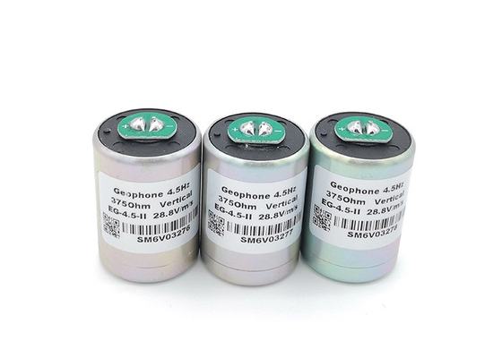

This section provides a comprehensive explanation of the hardware interfaces available on E-C111G. The following diagram illustrates the hardware interface:

## Power Interface

### Power Supply

The **E-C111G** operates on a DC power input ranging from **9 V to 12 V**, delivered through a **2-pin terminal block** or a **DC barrel jack** (available in newer hardware revisions). Internally, the input voltage is regulated to provide the multiple voltage rails required by the system: **+3.3 V**, **+2.5 V**, and **−2.5 V**.

The power input stage is robustly protected with:

- Overvoltage and short-circuit protection
- Reverse polarity protection
- A TVS (transient-voltage-suppression) diode to guard against input surges

The E-C111G is designed with energy efficiency in mind. Under normal operating conditions, its power consumption is approximately **0.6 W**.

### Power Control

The device includes an onboard **self-locking push-button switch** to control the main power. Pressing the switch powers on the system, and it remains latched until powered off.

To support development and diagnostics, **three voltage rail control jumpers** are provided:

- `JP1` — Controls the **+3.3 V** rail, primarily used by digital logic (e.g., MCU, OLED)
- `JP2` — Controls the **+2.5 V** rail, typically used by analog components such as op-amps and ADCs
- `JP3` — Controls the **−2.5 V** rail, required for analog signal processing stages

:::info
All jumpers are closed by default, enabling full functionality. Developers may open them to isolate power rails during troubleshooting or measurement.
:::

### Test Points

To facilitate voltage verification during testing or development, the PCB includes clearly marked test points on the rear side:

| Test Point | Description                            | Typical Voltage |
| ---------- | -------------------------------------- | --------------- |
| `TP4`      | DC-DC output for analog subsystems     | \~+5.5 V        |
| `TP2`      | Regulated analog reference             | +2.5 V          |
| `TP5`      | Digital supply for MCU and peripherals | +3.3 V          |
| `TP1`      | Inverted DC-DC output (pre-regulator)  | \~−5.0 V        |
| `TP3`      | Regulated negative analog rail         | −2.5 V          |

### Power Architecture

The internal power architecture is illustrated below:

The system employs multiple regulators for improved stability and noise performance. Notably, **analog and digital grounds are separated** on the PCB to minimize high-frequency interference between subsystems. The two ground planes are connected via a **0 Ω resistor**, allowing controlled return current flow while maintaining signal integrity.

## Communication Ports

The **E-C111G** supports multiple serial communication protocols to accommodate diverse deployment scenarios. Each interface outputs identical real-time data streams, allowing **simultaneous connection to multiple host systems** such as PCs, embedded controllers, or industrial gateways.

### RS-232 Interface

The RS-232 interface uses **industry-standard DB9 connectors**, with both **male** and **female** ports available on the device. The Explorer Kit includes a **DB9 male-to-female cable** for easy connection to host devices.

- **Connector Type**: DB9 (1× male, 1× female)
- **Voltage Level**: ±12V (compliant with RS-232 standard)
- **Maximum Baud Rate**: **409600 bps**
- **Duplex Mode**: Full-duplex
- **Recommended Cable Length**: Up to 10 m (depending on environment)
- **Use Case**: Ideal for **direct serial connections** to desktop computers, industrial PCs, or SBCs such as **Raspberry Pi** (via USB–RS232 adapters), offering mature driver support and excellent compatibility

The following figures illustrate the RS-232 connectors on E-C111G:

:::info
We recommend using the RS-232 interface in most scenarios due to its stability, simplicity, and broad compatibility across platforms.
:::

### RS-485 Interface

The RS-485 port is provided via a **2-pin screw terminal** for direct connection to twisted-pair cabling. It supports **differential half-duplex communication**, making it suitable for longer cable runs and more electrically noisy environments.

- **Connector Type**: 2-pin terminal block (A/B)
- **Voltage Level**: 3.3V logic (via transceiver)
- **Maximum Baud Rate**: **115200 bps**
- **Duplex Mode**: Half-duplex
- **Termination & Biasing**: External (user-supplied if required)
- **Recommended Cable Length**: Up to 50 m (at lower baud rates, using shielded twisted-pair)
- **Use Case**: Designed for **industrial and long-distance applications**, such as connecting remote sensors, outdoor enclosures, or distributed seismic arrays in field environments

The following figure illustrates the RS-485 signal lines on E-C111G:

:::info
RS-485 wiring is not standardized. Ensure consistent signal lines (A/B) alignment across all devices on the bus.
:::

### TTL Serial Interface

A **2.54mm 3-pin TTL-level UART header** is provided for embedded system integration or firmware development. This interface operates at **3.3 V logic levels** and is **not electrically isolated**, so careful attention must be paid during connection.

- **Connector Type**: 3-pin header (TX, RX, GND)
- **Voltage Level**: 3.3V logic (non-inverted)
- **Maximum Baud Rate**: **409600 bps**
- **Duplex Mode**: Full-duplex
- **Use Case**: Recommended for **embedded system development**, including:
    - Integration with **SBC GPIOs**
    - Direct serial communication with microcontrollers (STM32, RP2040, etc.)

:::danger Caution
Connecting this port to 5V logic (e.g., older Arduino boards) **may permanently damage the device**. Always verify voltage compatibility before use.
:::

### Summary

| Interface  | Connector Type    | Logic Level | Max Baud Rate | Duplex | Typical Use Case                       |
| ---------- | ----------------- | ----------- | ------------- | ------ | -------------------------------------- |
| RS-232     | DB9 (male/female) | ±12V        | 409600 bps    | Full   | General PC/server/SBC connection       |
| RS-485     | 2-pin terminal    | 3.3V diff.  | 115200 bps    | Half   | Long-distance communication            |
| TTL Serial | 3-pin header      | 3.3V        | 409600 bps    | Full   | SBC/microcontroller GPIO communication |

## Debugging and Boot Configuration

The **E-C111G** firmware is fully **open source** and actively maintained. Users are encouraged to customize, compile, and flash the firmware to suit their specific use cases. The system supports field upgrades and includes a **digital inclinometer mode**, which enables users to access onboard accelerometer data for precise leveling and optimal sensor installation.

### SWD Interface

The device provides a **Serial Wire Debug (SWD)** interface via a **3-pin 2.54 mm header**, compatible with standard development tools such as **ST-Link** and **J-Link**.

- `GND` — Ground
- `SWDIO` — Data I/O
- `SWCLK` — Clock

This interface allows for:

- Firmware flashing
- Breakpoint debugging
- Real-time memory inspection

:::danger Caution
The SWD interface is **not electrically isolated**. Use caution when connecting to a powered system to avoid potential damage to your programmer or the device.
:::

For example, when using the official **ST-Link V2** for SWD debugging, connect the pins as follows:

| ST-Link V2 Pin | E-C111G Pin |
| -------------- | ----------- |
| Pin 4 (GND)    | GND         |
| Pin 7 (SWDIO)  | DIO         |
| Pin 9 (SWCLK)  | CLK         |

:::info
If you are using J-Link or other SWD-compatible tools, please refer to the vendor’s pinout documentation to ensure proper connection.
:::

### Boot Mode Selection

The E-C111G provides **4 boot modes** selectable via a dual **BOOT0/BOOT1 jumper** configuration. These modes allow users to switch between normal operation, inclinometer mode, and firmware update modes.

| BOOT0 | BOOT1 | Boot Mode                | Description                                                                     |
| ----- | ----- | ------------------------ | ------------------------------------------------------------------------------- |
| 0     | 0     | Main Flash (Acquisition) | Default mode; runs the primary firmware for seismic data acquisition.           |
| 0     | 1     | Main Flash (Leveling)    | Starts the firmware in inclinometer mode to assist with installation alignment. |
| 1     | 0     | System Memory            | Enters STM32 built-in bootloader (for firmware upgrade via UART).               |
| 1     | 1     | Embedded SRAM            | Used for development and debugging temporary firmware loads.                    |

> ℹ️ **Note**: Boot mode is read on startup. After changing jumper positions, a **manual reset** is required to apply the new boot mode.

:::info Default Behavior
By default, the device boots from main flash (`BOOT0=0`, `BOOT1=0`) into seismic data acquisition mode.
:::

## Mode Configuration and Display

The **E-C111G** supports multiple operating modes that can be configured using onboard DIP switches. A built-in **0.96-inch OLED display** provides system status, configuration, and connectivity, making the setup process intuitive and efficient.

### Sampling Rate Configuration

The **sampling rate** determines how frequently data is read from the sensors each second. It is configured via the **SW3** DIP switch.

| SW3 Bits | Sample Rate | Notes                     |
| -------- | ----------- | ------------------------- |
| `00`     | 250 SPS     | Default setting           |
| `01`     | 200 SPS     |                           |
| `10`     | 100 SPS     |                           |
| `11`     | 50 SPS      | For bandwidth-limited use |

:::info
The sampling rate directly affects the data resolution and system bandwidth. Higher rates provide finer temporal detail but require more storage and bandwidth.
:::

### Baud Rate Configuration

The **baud rate** defines the transmission speed of serial data. It is configured using the **SW5** DIP switch.

| SW5 Bits | Baud Rate | Notes                          |
| -------- | --------- | ------------------------------ |
| `00`     | 57600     | Default; best stability        |
| `01`     | 115200    | Common for USB–Serial adapters |
| `10`     | 230400    | Faster transfer                |
| `11`     | 409600    | Maximum supported rate         |

:::info
Lower baud rates offer more robust communication, especially over long cables or electrically noisy environments. Adjust this according to your host system’s capability.
:::

### Extended Mode Options

Additional features can be enabled via **individual bits of the SW4 DIP switch**. These allow for specialized data acquisition modes.

#### Accelerometer-Only Mode

- **Control**: `SW4 bit 1`
- **Function**: Acquires data **only from the onboard accelerometer**, ignoring geophone input.

:::info
This bit is **ignored** when **6-channel mode** is enabled.
:::

#### GNSS Synchronization

- **Control**: `SW4 bit 2`
- **Function**: Enables GNSS synchronization at startup.
- **Startup Condition**:

    - Satellite count > 0
    - HDOP (Horizontal Dilution of Precision) ≤ 1.0

- **Behavior**:

    - Device waits for valid GNSS fix before beginning acquisition.
    - Automatically re-synchronizes when the **UTC date changes**, causing a brief (\~5 s) pause.

:::info GNSS Note
Ensure a compatible GNSS antenna is connected before enabling this mode.
:::

#### 6-Channel Acquisition Mode

- **Control**: `SW4 bit 3`
- **Function**: Enables acquisition of **both 3-axis geophone and 3-axis accelerometer data** (total 6 channels).

### OLED Display

The E-C111G is equipped with a **0.96-inch monochrome OLED screen** (model: **SSD1306**) connected via the **I²C interface**. This display provides:

- Acquisition status
- Connectivity status
- Sample rate and baud rate
- Firmware version and build number
- Leveling/tilt feedback (in inclinometer mode)

:::info
Even though the display improves usability, it is **not essential** for core functionality. The system continues to operate normally if the display is disconnected or damaged.
:::

:::danger Caution
Ensure the correct pinout is `GND – VCC – SCL – SDA` when replacing the display module. The OLED display is **not electrically isolated**. Ensure safe handling and wiring to prevent damage to the display or main board.
:::

## GNSS Antenna

The **E-C111G** provides a dedicated **SMA connector** for connecting an **active GNSS antenna**. This interface supplies a **3.3V DC bias voltage** to power the active circuitry within the antenna.

- **Connector Type**: SMA (female)
- **Bias Voltage**: 3.3 V (powered via RF center pin)
- **Antenna Type**: Active GNSS antenna (required)
- **Supported Bands**: L1 / L5 recommended (e.g., GPS, Galileo, QZSS)

:::info Do not use passive antennas
Passive GNSS antennas are **not supported**. The device expects an active antenna and may not function correctly or lock satellites without one.
:::

For optimal satellite visibility and time synchronization performance:

- Install the antenna in an **open-sky location**, free from buildings, trees, and obstructions.
- Avoid placing the antenna near **metal surfaces**, which may cause reflections and multipath errors.
- Use a **low-loss RF coaxial cable** (e.g., RG-174 or better) with minimal length where possible.
- Ensure the antenna is **firmly connected** to the SMA port before powering the device.

:::info
In GNSS-enabled mode, the device will not begin acquisition until it achieves a valid GNSS fix (minimum 1 satellite, HDOP ≤ 1.0).
:::

## Geophone Inputs

The E-C111G features **three analog input channels** designed specifically for **open-loop, velocity-type geophones**. These inputs are optimized for a **±2.5 V full-scale range**, matching the expected dynamic output of a properly matched geophone.

- **Input Type**: Differential, analog voltage
- **Input Range**: ±2.5 V (with input protection)
- **Sensor Type Required**: 4.5 Hz **open-loop, velocity-sensitive magnetic geophones**

The following figure shows a **typical open-loop velocity geophone** that is fully compatible with the E-C111G.

:::danger Sensor Compatibility Warning
Only **4.5 Hz open-loop geophones** should be connected to the E-C111G. Do **not** connect:

- Geophones with natural frequencies other than 4.5 Hz
- Broadband seismometers or accelerometers
- Force-balance or feedback-based sensors

Even though the inputs are protected against **overvoltage and current surges**, connecting incompatible high-sensitivity instruments can result in **signal distortion**, **loss of accuracy**, or **permanent damage** to the input circuitry.
:::

For accurate measurements and safety, always ensure the sensor is impedance-matched and within the specified dynamic range.
