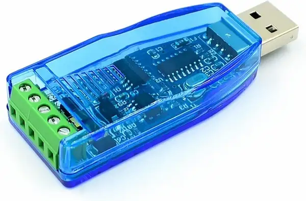
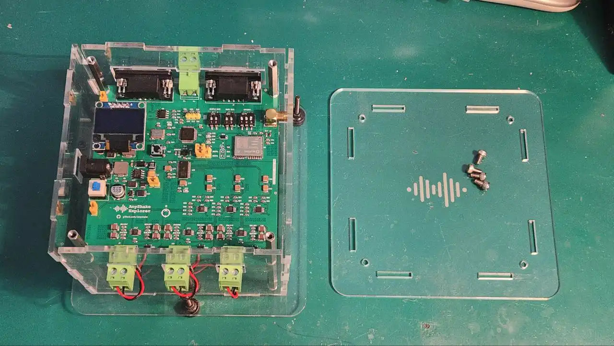

Thank you again for choosing our products. This guide will help you set up the AnyShake Explorer in a few simple steps—typically in less than one hour.

:::tip
If you have any questions during the setup, feel free to reach out for technical support. Read our [technical support policy](/docs/support-policy) for more details.
:::

## Before Setup

Make sure you have the following items ready:

- **AnyShake Explorer Kit**
    - This guide assumes the Full Kit version
- **Power Adapter**
    - Voltage range: 9 V–12 V DC (recommended: 12 V)
    - **Polarity**: Inner pin is positive (+), outer barrel is negative (−). This can be confirmed by checking the polarity symbols on the power adapter.
      
- **Data Cable** (choose one):
    - (preferred) RS-232 cable with DB9 connector, if the target computer does not have an RS-232 port, you can use an RS-232 to USB cable.
      
    - RS-485 cable with 2-pin terminal block, if the target computer does not have an RS-485 port, you can use an RS-485 to USB cable.
      
- **Active GNSS Antenna** (optional for GNSS sync)
    - 3.3 V bias voltage
    - L1/L5 dual-frequency recommended (GPS / Galileo / QZSS compatible)
    - Make sure the antenna has SMA connector (male)
      

## Setup Procedure

### 1. Disassemble the Top Acrylic Panel

Use the included Allen screwdriver to remove the top acrylic panel. This allows you to configure the operating mode.

Refer to [Mode Configuration and Display](/docs/anyshake-explorer/E-C111G/hardware-interface#mode-configuration-and-display) for details on DIP switch settings.

For example, to set:

- **Sample Rate**: 100 SPS
- **Baud Rate**: 115200
- **GNSS mode**: Enabled
- **6-Channel mode**: Enabled

Set the DIP switches as follows:

- **SW3: Sample Rate**

    | Bit | State |
    | --- | ----- |
    | 1   | ON    |
    | 2   | OFF   |

- **SW5: Baud Rate**

    | Bit | State |
    | --- | ----- |
    | 1   | OFF   |
    | 2   | ON    |

- **SW6: Operating Mode**

    | Bit | Description        | State |
    | --- | ------------------ | ----- |
    | 1   | Accelerometer-only | OFF   |
    | 2   | GNSS Enable        | ON    |
    | 3   | 6-Channel Mode     | ON    |

### 2. Choose an Installation Site

Place the device on a **flat, rigid, and stable surface**, ideally **directly coupled to a concrete slab or foundation**. This ensures good mechanical coupling to the ground, which is essential for accurate low-noise seismic measurements. Recommended locations include:

- Basement concrete floors
- Garage or utility room slab
- Reinforced indoor foundations
- Ground-level concrete surfaces

Avoid placing the unit on wood floors, tables, or platforms that may introduce micro-vibrations or resonance, also avoid the following:

- Locations near sources of **vibration** (e.g., HVAC systems, refrigerators, pumps, motors).
- Areas with **electromagnetic interference** (e.g., Wi-Fi routers, switching power supplies, SBCs like Raspberry Pi if placed too close).
- Surfaces that are unstable or that may shift over time.

#### Orientation

The geophones inside AnyShake Explorer are aligned along the standard seismic axes:

- Vertical (Z)
- East-West (E)
- North-South (N)

:::tip
Precise alignment is not required for general use, but it improves consistency when comparing across multiple devices or with regional seismic networks.
:::

To ensure proper orientation and accurate data, please align the device so that the **north arrow (N)** printed on the PCB (as shown below) is pointing toward **true north**. This directional indicator is located next to the **AnyShake Explorer** logo on the PCB silkscreen.

Use a compass (or a smartphone compass App) to determine the correct direction.

:::danger Caution
The geophones contain permanent magnets, which will interfere the results if the compass is held too close to the device. To avoid magnetic interference:

- Hold the phone at least 20–30 cm away from the device when using the compass.
- Cross-check the direction using a mechanical compass if available.

:::

#### GNSS Antenna

If you enabled the **GNSS mode**, follow these guidelines:

- Place the GNSS antenna near a **window or outside wall** with a clear view of the sky.
- Avoid placing the antenna under metal roofs or next to tall buildings or walls.
- If possible, **install the antenna outdoors** using a weatherproof SMA extension cable (≤5 m preferred).
- Use **UV- and water-resistant tape or sealant** to secure and protect the cable.

#### Cable Routing

- Route the **power and data cables** away from AC mains wiring, fluorescent lamps, or other high-frequency noise sources.
- Try to **avoid sharp bends or strain** on the RS-232 / RS-485 / GNSS cables.
- Ensure that all connectors are fully seated and secured before powering on.

:::tip
For the most accurate results, leave the device undisturbed after installation. Even small movements (e.g., footsteps nearby) can show up in the seismic signal.
:::

### 3. Connect the Power and Cables

- Connect the **DC power adapter** to the power jack.
- Plug in the **RS-232** or **RS-485** cable to the appropriate port.
- Connect the **GNSS antenna** to the SMA port if you are using GNSS.

:::danger
Be careful not to reverse the polarity of the power supply. Always use the included or certified adapter.
:::

### 4. Switch to Leveling Mode and Power on

To help with alignment, toggle the BOOT jumper to **leveling mode** (`BOOT0=0, BOOT1=1`). This mode activates the onboard accelerometer to measure tilt in real time.

Power on the device using the **self-locking power switch**. After a few seconds, the device will start to collect tilt data and display it on the OLED screen.

### 5. Level the Device Using Adjustable Screws

AnyShake Explorer is equipped with **three leveling screws** located on the bottom of the device. These allow for precise mechanical leveling to ensure accurate orientation of the geophones. Follow these steps to level the device:

1. Observe the **inclination values** (X and Y axes) displayed on the OLED screen.
2. Carefully **adjust the three leveling screws** to bring both axes as close to zero as possible.
    - A recommended tolerance is within **±0.1°**.
    - Adjust screws gradually and evenly to avoid stress on the acrylic frame.

Once the device is level, press the power button again to turn it off.

### 6. Switch to Data Acquisition Mode and Restart

Now that leveling is complete, configure the device to start collecting seismic data:

1. Set the **BOOT mode jumper** to **data acquisition mode**:
    - `BOOT0 = 0`, `BOOT1 = 0`
2. Press the **power button** again to restart the device.

If **GNSS mode** is enabled:

- The device will wait until a valid GNSS fix is acquired.
- Acquisition starts only when:
    - Number of visible satellites > 0
    - Horizontal Dilution of Precision (**HDOP**) ≤ 1.0

Once synchronization is successful, the device will enter **data acquisition mode**, and device status and connection information will be displayed on the OLED screen.

## After Setup

Once your device has entered data acquisition mode:

- **Connect to your host system** (e.g., PC, home server, Raspberry Pi, or NUC) using the serial cable you selected during setup.
- **Follow the documentation** to deploy and launch **AnyShake Observer**, the official companion software for real-time monitoring and analysis.
- Use the Observer interface to **visualize waveforms**, **configure services**, **review historical data**, and much more.

You're now ready — happy exploring!
