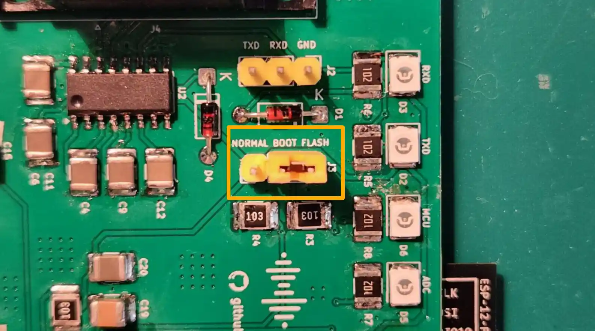
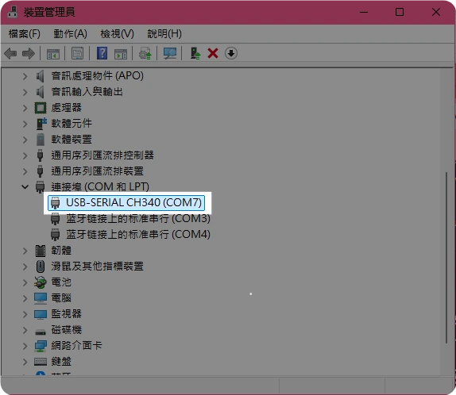
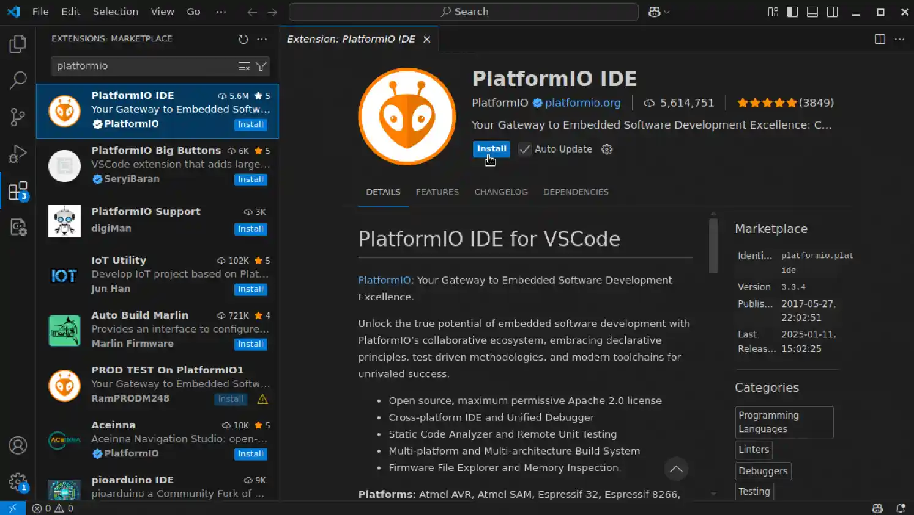
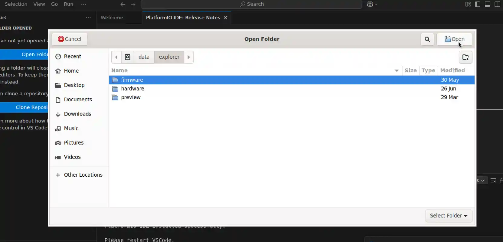
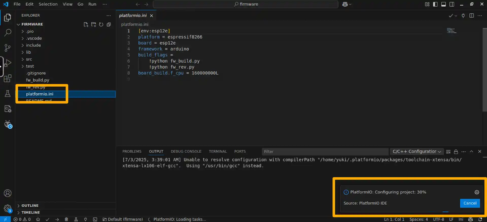
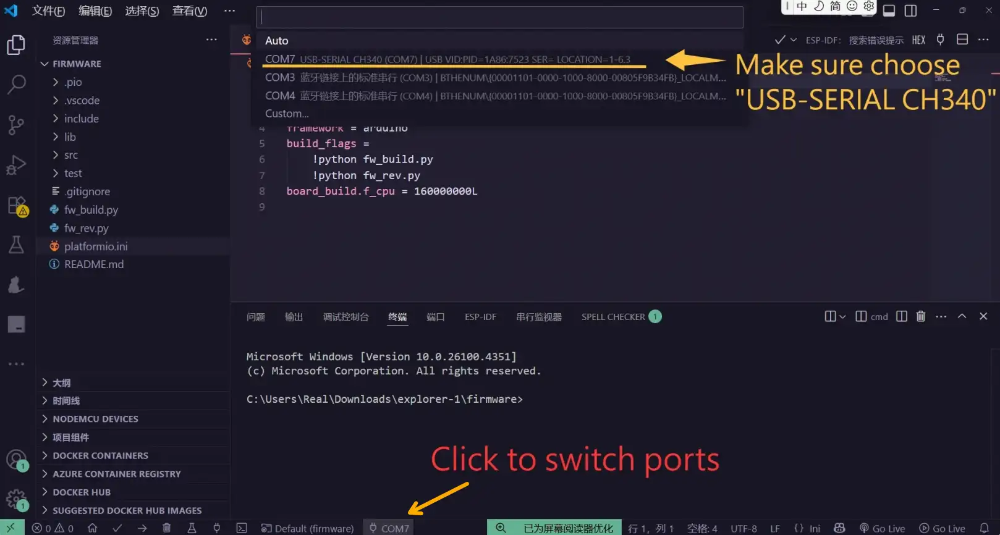
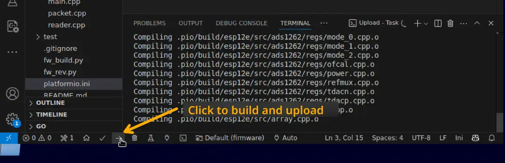
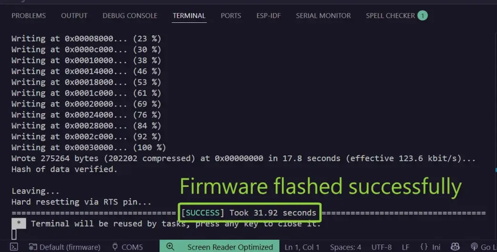
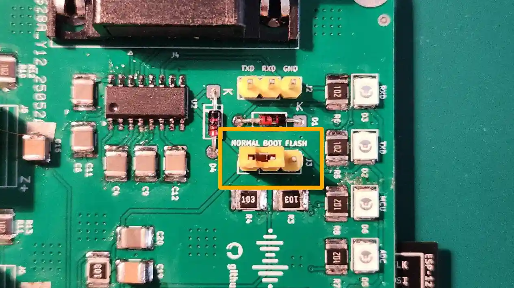

This tutorial will guide you through the process of upgrading the firmware on the AnyShake Explorer E-D001.

## Set BOOT Jumper to Flash Mode

To begin the firmware upgrade, you need to switch the BOOT jumper cap to **flash mode**.


Move the BOOT jumper cap to the side labeled **FLASH** on the PCB.



## Connect E-D001 to PC

Connect the E-D001 board to your PC using an RS-232 to USB cable, and power it on.

To verify the connection:

- **On Linux**, run the following command. The serial device usually appears as `ttyUSB*` or `ttyACM*`.
    ```bash
    $ ls /dev/tty*
    /dev/tty    /dev/tty20  /dev/tty33  /dev/tty46  /dev/tty59   /dev/ttyS13  /dev/ttyS26
    /dev/tty0   /dev/tty21  /dev/tty34  /dev/tty47  /dev/tty6    /dev/ttyS14  /dev/ttyS27
    /dev/tty1   /dev/tty22  /dev/tty35  /dev/tty48  /dev/tty60   /dev/ttyS15  /dev/ttyS28
    /dev/tty10  /dev/tty23  /dev/tty36  /dev/tty49  /dev/tty61   /dev/ttyS16  /dev/ttyS29
    /dev/tty11  /dev/tty24  /dev/tty37  /dev/tty5   /dev/tty62   /dev/ttyS17  /dev/ttyS3
    /dev/tty12  /dev/tty25  /dev/tty38  /dev/tty50  /dev/tty63   /dev/ttyS18  /dev/ttyS30
    /dev/tty13  /dev/tty26  /dev/tty39  /dev/tty51  /dev/tty7    /dev/ttyS19  /dev/ttyS31
    /dev/tty14  /dev/tty27  /dev/tty4   /dev/tty52  /dev/tty8    /dev/ttyS2   /dev/ttyS4
    /dev/tty15  /dev/tty28  /dev/tty40  /dev/tty53  /dev/tty9    /dev/ttyS20  /dev/ttyS5
    /dev/tty16  /dev/tty29  /dev/tty41  /dev/tty54  /dev/ttyS0   /dev/ttyS21  /dev/ttyS6
    /dev/tty17  /dev/tty3   /dev/tty42  /dev/tty55  /dev/ttyS1   /dev/ttyS22  /dev/ttyS7
    /dev/tty18  /dev/tty30  /dev/tty43  /dev/tty56  /dev/ttyS10  /dev/ttyS23  /dev/ttyS8
    /dev/tty19  /dev/tty31  /dev/tty44  /dev/tty57  /dev/ttyS11  /dev/ttyS24  /dev/ttyS9
    /dev/tty2   /dev/tty32  /dev/tty45  /dev/tty58  /dev/ttyS12  /dev/ttyS25  /dev/ttyUSB0
    ```
    Where `/dev/ttyUSB0` is the device you want to use.
- **On Windows**, open **Device Manager** and check under **Ports (COM & LPT)**.
  

## Setup PlatformIO

[PlatformIO](https://platformio.org/) is an open-source embedded development environment used to build and upload firmware. To install PlatformIO, you need insall [Python](https://www.python.org/) and [Visual Studio Code](https://code.visualstudio.com/) first.

After installing, you can open Visual Studio Code and click **Extensions**, search to install "PlatformIO" extension.



It usually takes a few minutes to install the extension. Restart Viaual Studio Code after PlatformIO installation for the extension to initialize properly.

## Get Latest Firmware

The firmware source code for E-D001 is located in the `v1` branch of the [AnyShake Explorer GitHub repository](https://github.com/anyshake/explorer), under the `firmware/` directory.

To get source files, you need to clone the repository and checkout the corresponding branch.

If you have `git` installed, you can use the following command to clone the repository:

```bash
$ git clone --depth 1 -b v1 https://github.com/anyshake/explorer
```

Or get the latest project files using the following direct link, after downloading, extract the archive and locate the `firmware` directory.

- [github.com/anyshake/explorer/archive/refs/heads/master.zip](https://github.com/anyshake/explorer/archive/refs/heads/master.zip)
- [github.com/anyshake/explorer/archive/refs/heads/master.tar.gz](https://github.com/anyshake/explorer/archive/refs/heads/master.tar.gz)

## Open Firmware Project

1. Press `Ctrl + K, O` (or `Cmd + K, O` on macOS)
2. Select the `firmware` folder inside the repository



You should see the `platformio.ini` file in the root of the project. PlatformIO will automatically initialize the environment.



## Build and Upload

Select the correct serial port that you identified earlier.



Then click the **Upload** button in the PlatformIO toolbar to compile and flash the firmware.



It usually takes a while to build firmware and upload to the device. If successful, you’ll see a confirmation message:



## After Flashing

1. Move the BOOT jumper cap back to **normal mode**.
   
2. Press the **Reset** button on the E-D001 board.

Your device is now running the updated firmware and ready for use!
