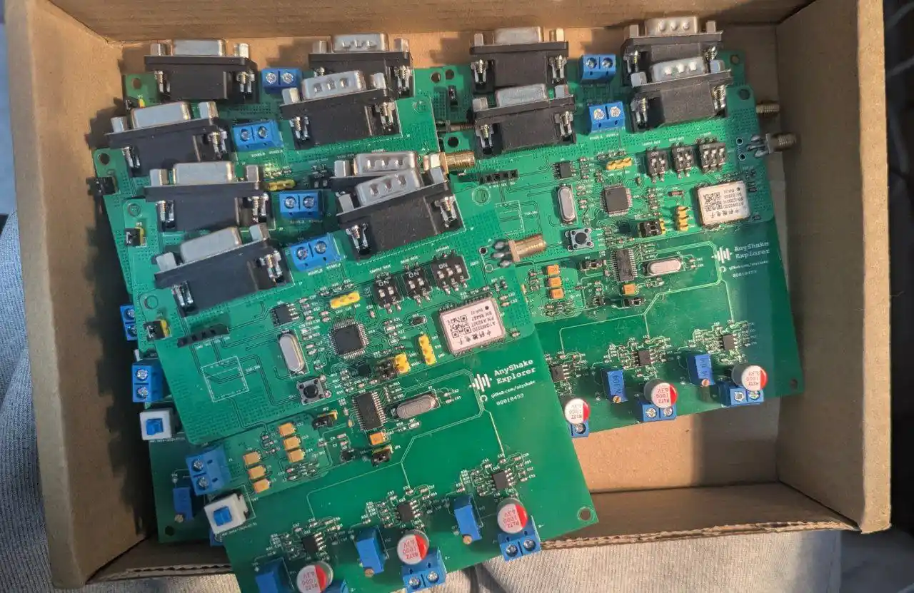
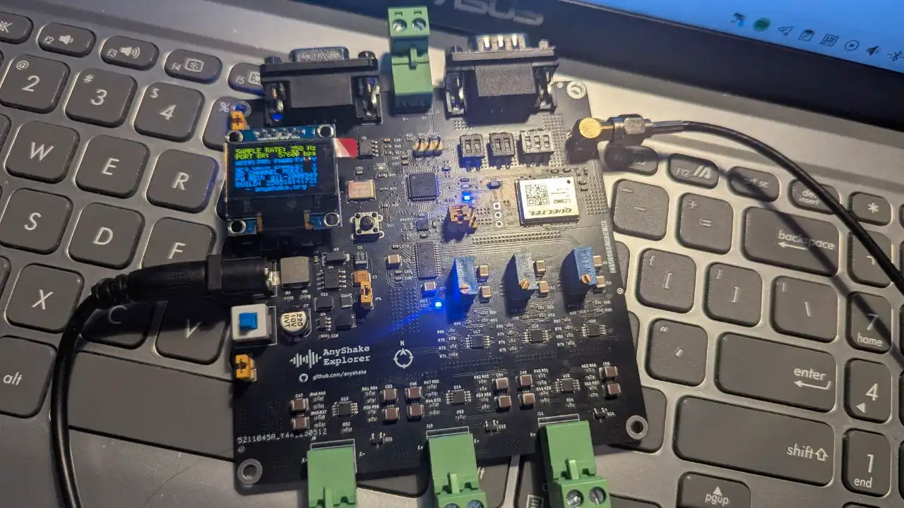

## The Story of AnyShake Explorer

The **AnyShake Explorer** was first conceived in 2023, when a Chinese undergraduate student, unable to afford the expensive RS3D, decided to build a solution from scratch. The original prototype was a modest, amateur effort based on the ADS1256.

Later, the ADS1256 was upgraded to an ADS1262, which was then integrated with an MCU onto a PCB board.

After several iterations, the design evolved from a basic ADC-only version to one that integrated a 3-axis accelerometer and a front-end amplifier. It drew inspiration from the amplifier design of [olewolf/geophone](https://github.com/olewolf/geophone/blob/master/Amplifier%20Schematic.pdf), but due to the simplicity of that approach, the system still suffered from excessive noise.

**Through extensive research of academic papers, countless experiments, and persistent debugging, the final version of the product emerged — now known as the AnyShake Explorer.**

At the beginning, the AnyShake Project encouraged users to DIY hardware, but as the project grew, the project maintainer received numerous requests from users hoping to directly purchase a finished product. In response, the original developer established **SensePlex Limited** at the end of 2024, aiming to commercialize the AnyShake product while preserving its open-source nature and achieving sustainable development.

## Architecture and Toolchains

**AnyShake Explorer** is designed using **KiCAD**, with an **STM32** microcontroller at its core. Development tools include **STM32CubeMX** and **PlatformIO**, and the system runs **FreeRTOS**. The device features a 32-bit ADC, a built-in low-noise 3-axis accelerometer (16-bit), and supports connecting up to **three 4.5 Hz geophones** (for a total of six axes) to monitor seismic activity simultaneously. It also includes onboard **temperature sensor**, allowing users to monitor ambient conditions alongside seismic data. To match the performance of proprietary competitors, a pole-zero compensation circuit was implemented for geophone signal conditioning, effectively extending the instrument period to **2 seconds (0.5 Hz)** and enabling improved detection of distant seismic events.

Unlike some solutions, **AnyShake Explorer does not include an integrated single-board computer (SBC)**. This design choice results in **ultra-low power consumption** and **avoids electromagnetic interference** commonly introduced by onboard components like Wi-Fi—a frequent complaint among Raspberry Shake users. Instead, data is transmitted via **RS-232** or **RS-485** to an external computer, such as a laptop, x86_64 server, NUC, or Raspberry Pi. AnyShake Explorer is fully compatible with **Windows**, **Linux**, and **macOS** systems.

## Product Models

Currently, the AnyShake Explorer comes in three models:

- E-C111G
- E-C121G
- E-D001

**E-C111G is the officially released version**. E-C121G was used during the closed testing phase and remains compatible with the E-C111G. The main difference lies in the accelerometer model: the E-C111G uses the **LSM6DS3**, while the E-C121G uses the **ICM-42688-P**.

**E-D001** is the early version of the AnyShake Explorer hardware, found on the **[v1 branch](https://github.com/anyshake/explorer/tree/v1)**. It is based on the **ESP8266** platform, some early adopters of the AnyShake Project built their own units and continue to use them.

## Resourses

- [E-C111G/E-C121G Branch](https://github.com/anyshake/explorer/tree/master)
- [E-D001 Branch](https://github.com/anyshake/explorer/tree/v1)
