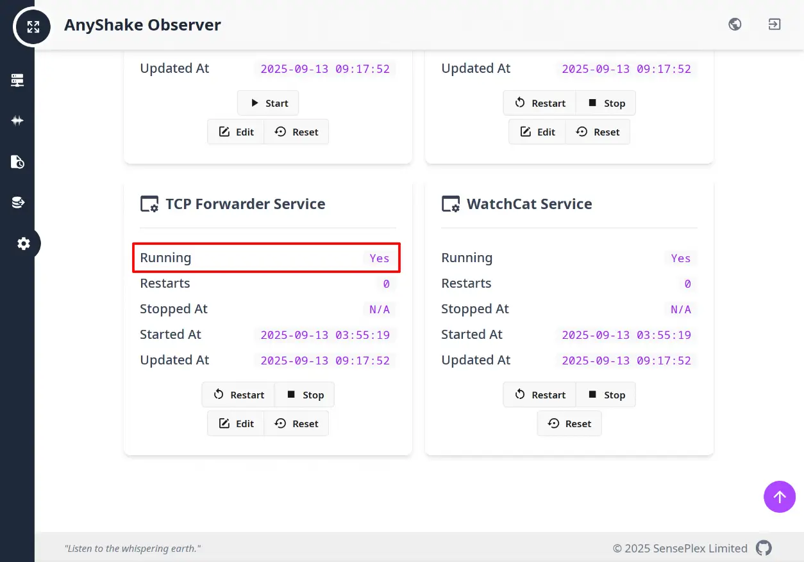

SeisComP is a widely used open-source system for earthquake monitoring and data management. It provides a comprehensive solution for seismic data acquisition, real-time processing, and visualization, supporting a wide range of seismometers and standard protocols such as SeedLink. SeisComP is adopted globally by seismic monitoring agencies and research institutions for its reliability, scalability, and flexible plugin architecture.

For AnyShake users, we strongly recommend the **AnyShake Nexus plugin** to integrate with SeisComP. Compared to using the SeedLink protocol directly, Nexus ensures full device compatibility, preserves the essential functions of the chain plugin, and avoids SeedLink’s limitations. Written in pure Go with no external dependencies, it is easy to deploy, highly robust, and represents the best practice for connecting AnyShake devices to SeisComP.

The AnyShake Nexus plugin is open source and available on [GitHub](https://github.com/anyshake/nexus). It has been tested with SeisComP **4.5.0 and later**.

Nexus relies on the **TCP Forwarder Service** provided by AnyShake Observer. This service is enabled by default and automatically listens on the local host.

If SeisComP is running on a different machine, change the listening address to `0.0.0.0` and restart the service.

