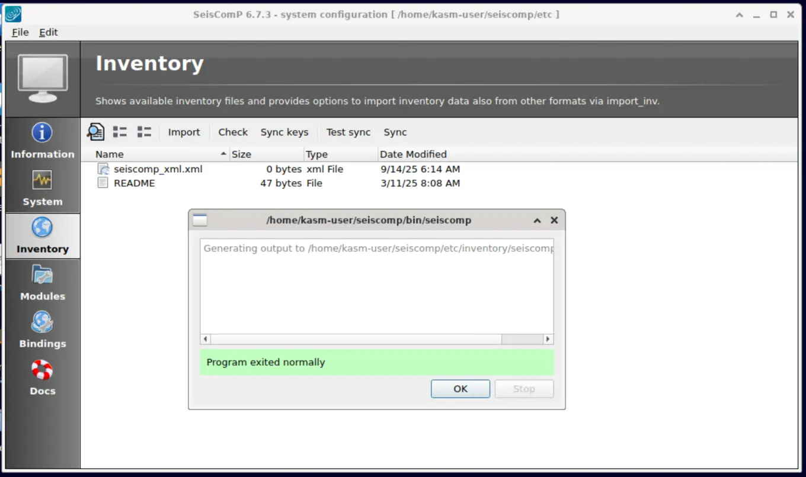
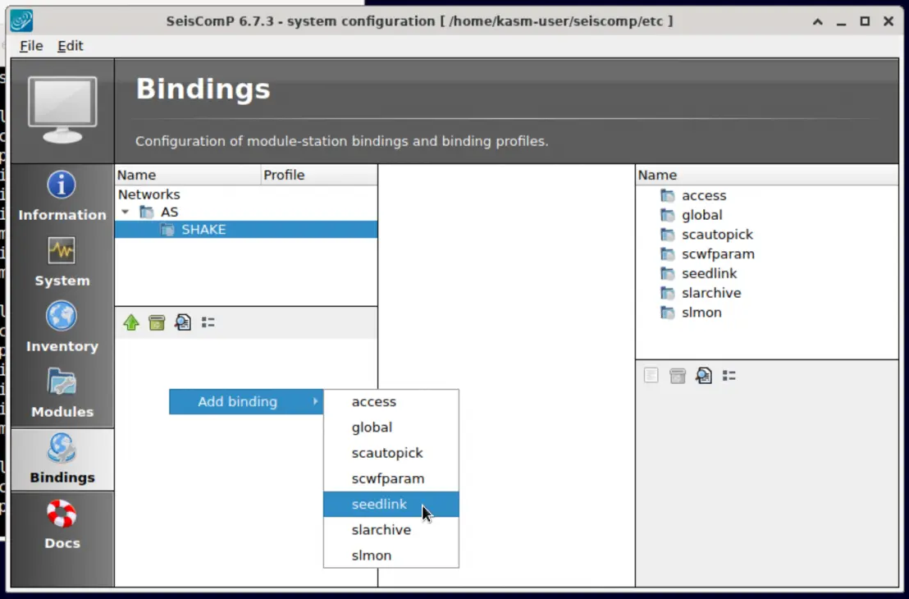
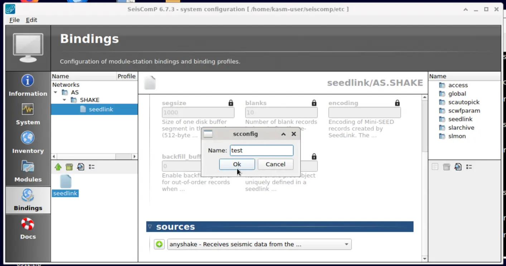
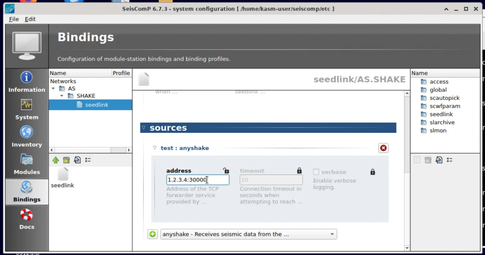
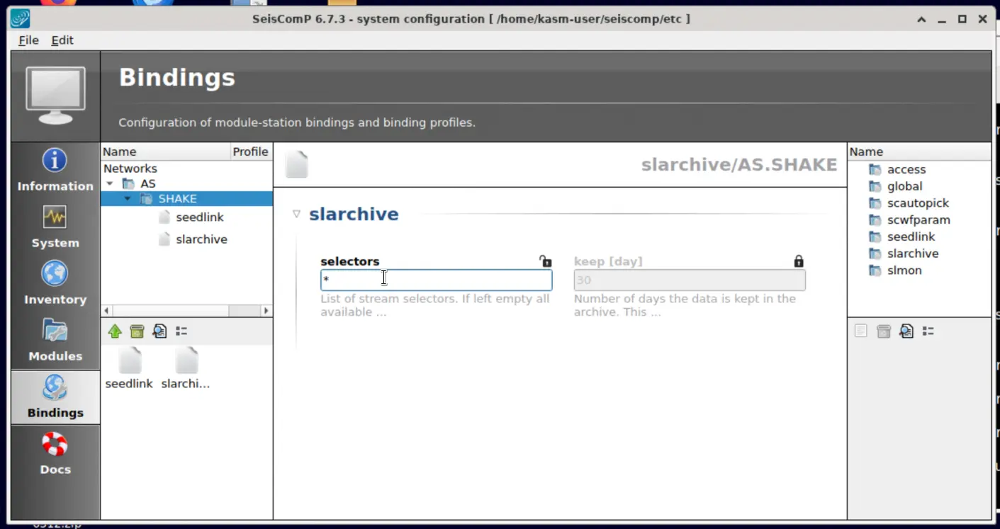
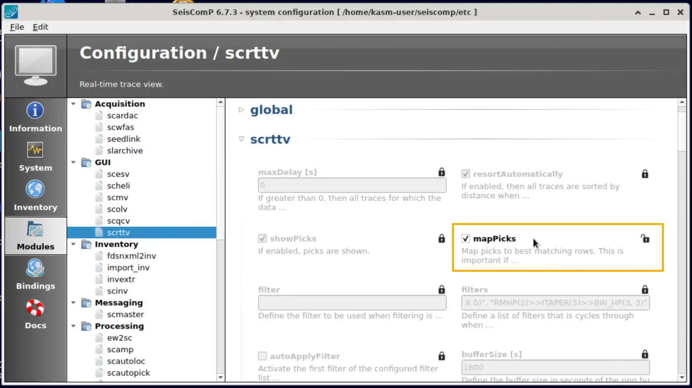
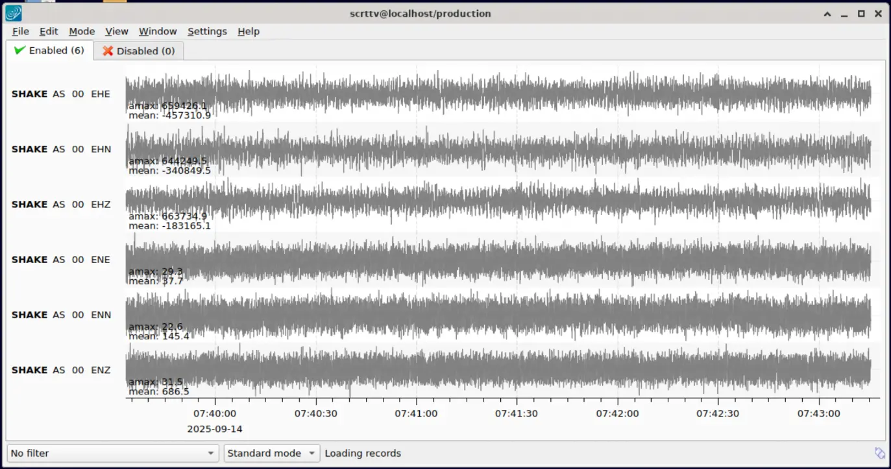

To add a new station in SeisComP, the process generally involves following steps:

1. Import the Inventory
2. Configure the Binding
3. Set up related modules
4. Apply the configuration

In SeisComP, the **Inventory** refers to the station metadata, which describes the network, stations, data channels, and instrument configurations. This information is usually stored in XML (SEED/StationXML) format and includes:

- **Network**: Network code, e.g., IU, II
- **Station**: Station location, name, coordinates, activation time, etc.
- **Sensor**: Sensor model, sensitivity, poles and zeros, calibration factors
- **Data logger**: Information about the data acquisition system
- **Channel**: Channel combinations (e.g., EHZ, BHE, HHN), including response, sampling rate, filters, etc.

The Inventory acts as a “static database describing the stations and equipment” and forms the basis for waveform decoding, processing, and distribution. For example, station locations determine the accuracy of event localization, while channel responses affect the correctness of moment tensor or magnitude calculations.

In the AnyShake Project, automatically generated station metadata can be found in the **Settings** page and is distributed in both **SeisComP XML** and **FDSN StationXML** formats.

In contrast, the **Binding** defines how software modules are linked to stations and channels. SeisComP includes various modules (such as SeedLink, scautopick, scautoloc, scamp), and each needs to know how to process the data from specific stations or channels. The binding serves the following purposes:

- Specify which stations/channels a module should process
- Configure module-specific parameters (e.g., picking thresholds, filter settings)
- Support differentiated processing for different stations/channels

In this tutorial, we will create the following bindings and connect them to AnyShake devices via the **AnyShake Nexus** plugin:

- **seedlink**: real-time data source configuration
- **slarchive**: waveform archiving configuration
- **scautopick**: station-specific picker configuration
- **global**: system-wide configuration

## Import the Inventory

As mentioned previously, the station metadata is available in both SeisComP XML and FDSNWS StationXML formats in AnyShake Observer. You can download the XML file from the **Settings** page. In the tutorial, the SeisComP XML format is downloaded.


:::info
The station metadata includes the current station location, channel information, and instrument response information. It's automatically generated from your local settings, and should not be modified manually. **When the local settings is updated, the metadata should be updated accordingly**.
:::

Open the system configuration tool with the following command:

```bash
$ scconfig
```

Go to **Inventory** tab, click **Import**, and select **sc3** as input format, also choose the path to your SeisComP XML file in the prompt dialog, and click **OK**:


If successful, you will see the following message:



After importing, the file list will be updated with the newly added metadata, select the file and click **Sync** button, click **Yes** in the warning dialog, the metadata will be synchronized to SeisComP database:


:::info
If you encounter an error such as **[error] Could not connect to message** system while synchronizing metadata, try switching back to the **System** tab and restarting the **scmaster** module. If the issue persists, you will usually need to check the database connection and related settings.
:::

## Configure the Binding

Go to the **Binding** tab, and you will see that the basic configurations such as station code and network name have already been generated automatically.


Double-click to enter the innermost station code, then right-click on the blank area at the lower left corner and select the module you want to add:



### seedlink

Create a new **seedlink** binding, and under **sources** add a new **AnyShake** instance. You can assign any name to this instance.



In the newly created instance, enter the address of the server running the TCP Forwarder. Depending on your network conditions, you can also customize the timeout value (default: 10 seconds):



Remember to use the **Ctrl + S** combination key to save the changes.

### slarchive

Create a new **slarchive** binding and set the **selectors** field to **\***.



Remember to use the **Ctrl + S** combination key to save the changes.

### scautopick

Create a new **scautopick** binding and adjust the trigger settings as needed. In this example, we use the default configuration.


Remember to use the **Ctrl + S** combination key to save the changes.

### global

Create a new **global** binding, set the location code, and specify the stream code for event detection. Typically, these are set to **00** and **EHZ**, following the default settings in AnyShake Observer.


:::info
If you modified any settings in **AnyShake Observer**, make sure to update them here as well.
:::

Remember to use the **Ctrl + S** combination key to save the changes.

## Apply the Configuration

Go to the **Modules** tab, select **scrttv** from the left-hand sidebar, and check the **mapPicks** option.



Press **Ctrl + S** to save the changes. Then, go back to the **System** tab, hold the **Ctrl** key, and multi-select the following modules:

- scmaster
- scamp
- scautoloc
- scautopick
- scevent
- scmag
- scqc
- scvoice
- seedlink
- slarchive

Click **Update Configuration** and wait for the process to complete.


Next, click **Restart** and wait for the selected modules to start.


If everything is successful, the **Status** column of the selected modules will change to **Running**.

## See the Waveform

Open the **scrttv** module using the following command:

```bash
$ scrttv
```

Now you will be able to see the realtime waveform with all channels from AnyShake.



## Show on the Map

Open the **scmap** module using the following command:


You can also also right-click on the station marker view the realtime waveform and data quality.
