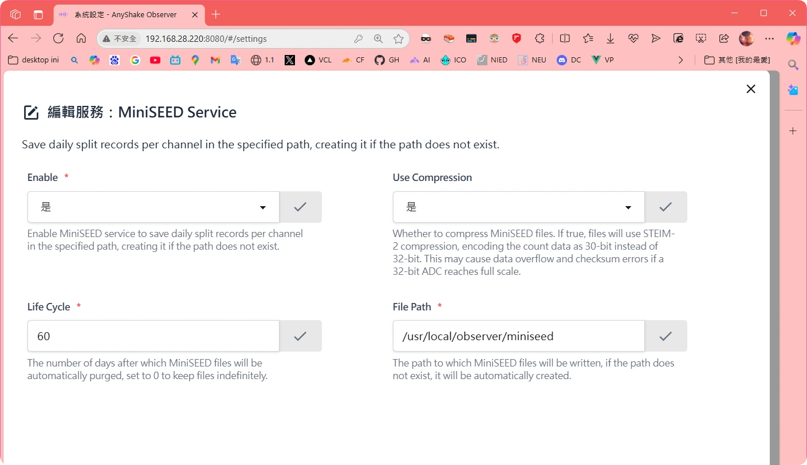
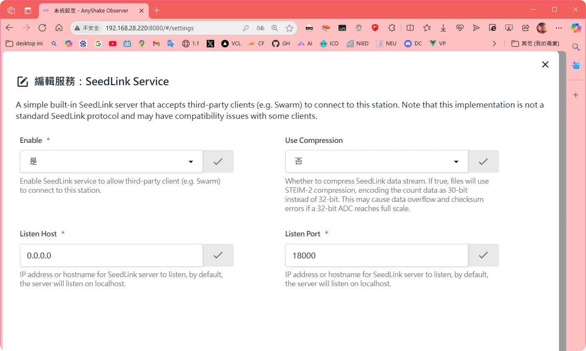

This guide provides detailed instructions for configuring **MiniSEED** and **SeedLink** services on the AnyShake Observer.

## MiniSEED Service
The MiniSEED Service is a service used for seismic data recording. It saves daily segmented records by channel to a specified path. The service provides data compression and an automatic cleanup mechanism, making it an essential data storage component in seismic observation systems.

### Features
- Automatically segments and stores data by channel on a daily basis.
- Supports automatic directory creation.
- Optional data compression.
- Configurable data lifecycle management.

### Configuration Interface


### Enabling the Service
To enable the MiniSEED service, check the "`Enable`" option in the configuration interface. Once enabled, the service will start saving daily segmented records by channel to the specified directory.

### Configuring Compression
The "**Use Compression**" option controls whether MiniSEED files are compressed:

- `Enabled (Yes)`: Uses the STEIM-2 compression algorithm, encoding sample data in 30 bits instead of 32 bits.

- `Disabled (No)`: Stores raw, uncompressed data.
:::info NOTE
If a 32-bit ADC reaches full scale, it may cause data overflow or checksum errors.
:::

### Setting Data Lifecycle
The "**Life Cycle**" parameter defines the number of days files are retained:

- `0`– Setting it to means files are retained permanently with no automatic deletion.
- `60`– Setting this to means files will be automatically deleted after 60 days.

### Specifying the Storage Path
The "**File Path**" defines where MiniSEED files are stored:
- **Default path (on Linux)**: 
```bash
/usr/local/observer/miniseed
```
:::warning
If the path does not exist, the system will automatically create it, ensure the specified path has sufficient storage space.
:::

### Notes
1. When compression is enabled, verify that your device does not reach the full scale of the 32-bit ADC to prevent data issues. For long-term monitoring stations, it is recommended to configure a reasonable lifecycle (e.g., 60 days) to prevent disk space exhaustion.
2. Regularly check the available space in the storage path, especially if files are set to be retained permanently. If storage space is ample, consider disabling compression for more reliable raw data storage.
3. Ensure the service account has read and write permissions for the specified path.
4. Backup important data regularly, even if long-term retention is configured.

:::info REMEMBER
A service restart is required for configuration changes to take effect.
:::

### Troubleshooting
**Common issues and solutions**:
- **Cannot get data**:
  - Verify the service is enabled.
- **Data errors**：
  - Try disabling compression.

   
By properly configuring the MiniSEED Service, you can ensure reliable seismic data recording while efficiently managing your storage resources.

## SeedLink Service
A simple built-in SeedLink server that accepts third-party clients (e.g. Swarm) to connect to this station.
:::info note
 This implementation is not a standard SeedLink protocol and may have compatibility issues with some clients.
:::

### Features
- Provides real-time seismic data streaming.
- Supports compressed data transmission.
- Configurable listening address and port.
- Lightweight service implementation.
  
### Configuration Interface


### Enabling the Service
To enable the SeedLink service, check the "`Enable`" option in the configuration interface. Once enabled, the service will begin listening on the specified port for incoming client connections.

### Configuring Compression
The "**Use Compression**" option determines whether to compress the data stream:

- `Enabled (Yes)`: Uses the STEIM-2 compression algorithm, encoding sample data in 30-bit instead of 32-bit.

- `Disabled (No)`: Stores raw, uncompressed data.
:::info NOTE
If a 32-bit ADC reaches full scale, it may cause data overflow or checksum errors.
:::

### Listening Host
The "**Listen Host**" parameter specifies the server's listening address:

- **Default**:  `0.0.0.0` (listen on all network interfaces)
- Can be set to a specific **IP address** or **hostname**.
- Set to `127.0.0.1` to allow only local connections

### Listening Port
The "**Listen Port**" parameter specifies the port the service listens on:
- **Default port**: `18000`
- Can be changed to any available port in the range `1-65535`.
- Ensure your firewall allows inbound connections on this port.

### Notes
1. This is a non-standard SeedLink implementation and may not work with all clients.
2. Binding to 0.0.0.0 exposes the service to all networks; evaluate associated risks. In production environments, restrict access using firewall rules or IP whitelisting.
3. For sensitive deployments, consider using a VPN tunnel rather than exposing the service directly.
4. Make sure the chosen port is not already in use by another service.
5. Third-party clients like Swarm must be configured with the correct connection parameters. If clients fail to connect, first verify that compression settings match on both ends.

:::info REMEMBER
A service restart is required for configuration changes to take effect.
:::

### Troubleshooting
**Common issues and solutions**:
- **Client cannot connect**:
  - Verify the service is enabled.
  - Check if the listening address and port are correctly configured.
  - Review firewall or security group rules.
- **Data transmission errors**:
  - Try disabling compression.
  - Ensure the client supports non-standard SeedLink protocols.


By properly configuring the SeedLink Service, you can securely and efficiently provide real-time seismic data streams to authorized clients.