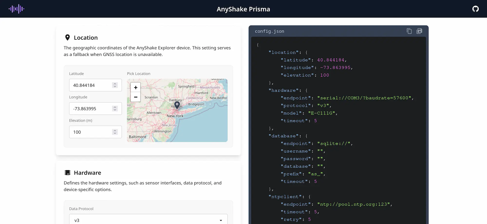
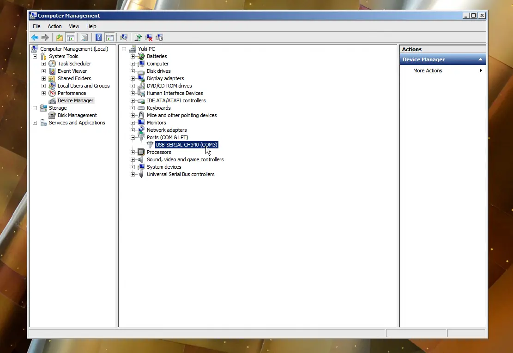
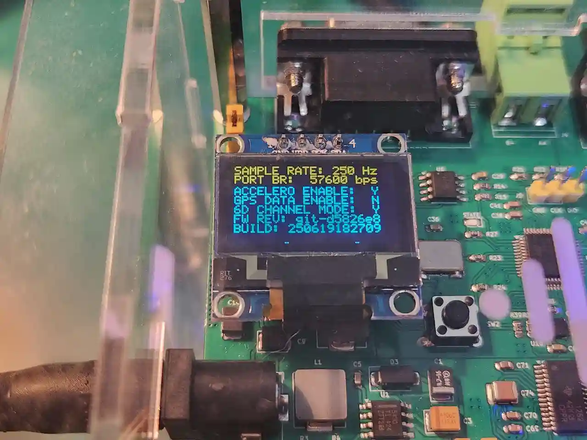
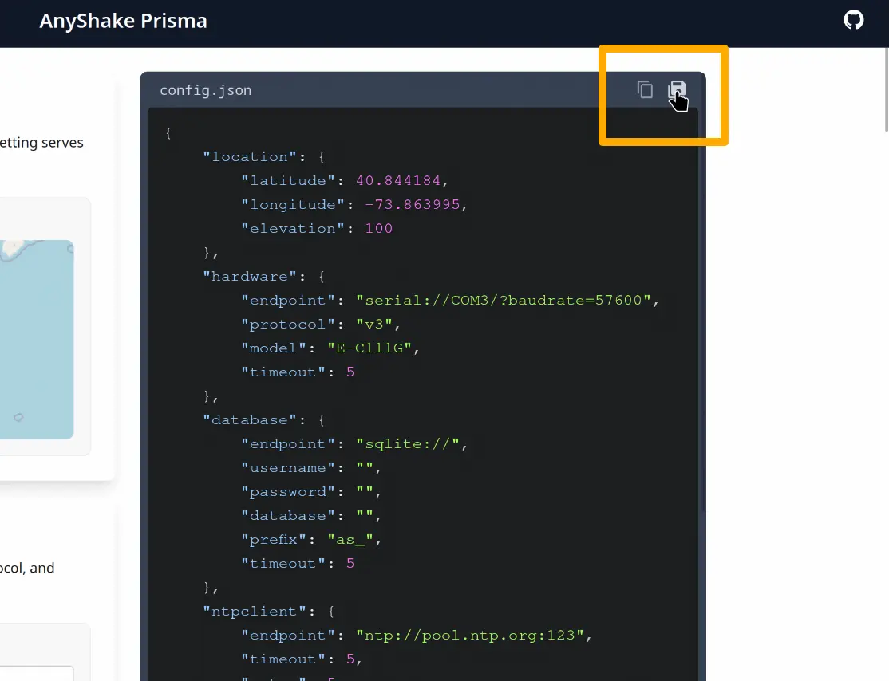

**AnyShake Observer** requires a minimal configuration to initiate its core services. This configuration is defined in a JSON file, which includes essential parameters such as site coordinates, connection details for AnyShake Explorer, web server settings, database configuration, logging preferences, and more.

For general users, we highly recommend using **AnyShake Prisma** — a visual configuration tool developed by the AnyShake Team — to automatically generate the necessary configuration file. Simply complete the form provided by the tool, and it will generate a valid configuration file for you. No prior technical knowledge is required.

This guide will walk you through the process of using AnyShake Prisma to quickly configure AnyShake Observer and establish a connection with your deployed AnyShake Explorer device.

## Accessing the Configuration Tool

Open the AnyShake Prisma website at [anyshake.github.io/prisma](https://anyshake.github.io/prisma). Upon loading, you will be presented with the following interface:



On the left side of the screen is a configuration form for user input, while the right side displays the corresponding JSON configuration file, generated in real time. Any changes made in the form will be immediately reflected in the configuration preview.

:::tip
The AnyShake Prisma website uses a technology called Service Worker to cache resources locally. Once accessed, the site remains available even when you are offline.
:::

## Filling in the Form

### Location

This field specifies the fallback coordinates of your station, including **latitude**, **longitude**, and **elevation**. These values will be used only if GNSS data is unavailable — once GNSS becomes available, this field will be automatically overridden.

In AnyShake Observer, precise location data is shown only to users with administrator privileges. For regular users, coordinates are intentionally obfuscated to protect privacy. Therefore, you can confidently enter accurate site information.

Alternatively, you can select your site location by interacting with the map component embedded in the form. Clicking on the map will automatically update the coordinate fields. The map is based on OpenStreetMap (OSM) layers, and the available zoom level depends on the tile provider.

:::info
It is essential to provide accurate coordinates, as they directly impact key system functionalities. For example, the event backtracking feature uses these coordinates to calculate the estimated arrival time of seismic waves.
:::

### Hardware

This field specifies the connection settings for the AnyShake Explorer. Incorrect values will prevent the system from establishing a connection with your device.

#### Data Protocol

Since its inception, the AnyShake Project has undergone three iterations of its data protocol:

- **v1**: The original version, supported by all AnyShake Observer releases. Currently, no AnyShake Explorer devices use this protocol.
- **v2**: Supported by AnyShake Observer v3.x.x and later. Currently used by the E-D001 model.
- **v3**: Supported by AnyShake Observer v4.x.x and later. Currently used by models E-C111G and E-C121G.

#### Product Model

Select or manually specify your device model, such as E-C111G or E-D001.

AnyShake Observer uses this information to associate built-in metadata, which will be displayed on the settings page.

:::info
For models other than E-C111G and E-C121G (e.g., custom instruments), metadata will not be available.
:::

#### Transport Type

AnyShake Observer currently supports device connections via serial port or TCP/IP. The serial port is typically the default option for AnyShake Explorer devices, while TCP/IP is useful when using a serial-to-Ethernet converter. If you are unsure which method applies, please select serial port.

:::danger
If you access AnyShake Observer via TCP/IP, we strongly recommend enabling GNSS mode on the AnyShake Explorer. This is because Ethernet latency is typically unpredictable, and significant fluctuations in network delay may cause AnyShake Observer to actively discard received data packets.
:::

#### Serial Port / TCP Hostname

**For serial port**, enter the serial port identifier here, such as `COM5` on Windows or `/dev/ttyACM0` on Linux.

To find your serial port name on Windows, open Device Manager and locate the port under the device list. The example below shows the serial port named `COM3`:



:::tip
If you find that the device does not show a serial port but appears as an unknown device, try installing the appropriate driver and then reconnect.
:::

On Linux systems, serial port names typically begin with `tty` followed by an identifier, such as `ttyUSB0` or `ttyACM0`. You can identify the device by running commands like `sudo dmesg | grep tty` or `ls /dev/tty*`. The example below shows output indicating the serial port as `/dev/ttyUSB0`:

```bash
$ sudo dmesg | grep tty
...
[   94.805749] ch341-uart ttyUSB0: break control not supported, using simulated break
[   94.806063] usb 1-6: ch341-uart converter now attached to ttyUSB0
...
$ ls /dev/tty*
/dev/tty    /dev/tty20  /dev/tty33  /dev/tty46  /dev/tty59   /dev/ttyS13  /dev/ttyS26
/dev/tty0   /dev/tty21  /dev/tty34  /dev/tty47  /dev/tty6    /dev/ttyS14  /dev/ttyS27
/dev/tty1   /dev/tty22  /dev/tty35  /dev/tty48  /dev/tty60   /dev/ttyS15  /dev/ttyS28
/dev/tty10  /dev/tty23  /dev/tty36  /dev/tty49  /dev/tty61   /dev/ttyS16  /dev/ttyS29
/dev/tty11  /dev/tty24  /dev/tty37  /dev/tty5   /dev/tty62   /dev/ttyS17  /dev/ttyS3
/dev/tty12  /dev/tty25  /dev/tty38  /dev/tty50  /dev/tty63   /dev/ttyS18  /dev/ttyS30
/dev/tty13  /dev/tty26  /dev/tty39  /dev/tty51  /dev/tty7    /dev/ttyS19  /dev/ttyS31
/dev/tty14  /dev/tty27  /dev/tty4   /dev/tty52  /dev/tty8    /dev/ttyS2   /dev/ttyS4
/dev/tty15  /dev/tty28  /dev/tty40  /dev/tty53  /dev/tty9    /dev/ttyS20  /dev/ttyS5
/dev/tty16  /dev/tty29  /dev/tty41  /dev/tty54  /dev/ttyS0   /dev/ttyS21  /dev/ttyS6
/dev/tty17  /dev/tty3   /dev/tty42  /dev/tty55  /dev/ttyS1   /dev/ttyS22  /dev/ttyS7
/dev/tty18  /dev/tty30  /dev/tty43  /dev/tty56  /dev/ttyS10  /dev/ttyS23  /dev/ttyS8
/dev/tty19  /dev/tty31  /dev/tty44  /dev/tty57  /dev/ttyS11  /dev/ttyS24  /dev/ttyS9
/dev/tty2   /dev/tty32  /dev/tty45  /dev/tty58  /dev/ttyS12  /dev/ttyS25  /dev/ttyUSB0
```

**For TCP/IP**, enter the hostname or IP address of your AnyShake Explorer. For example, if your device’s address is `10.0.0.21:12345`, enter `10.0.0.21` in this field.

#### Serial Baudrate / TCP Port

**For serial port**, enter the baud rate. You can verify the baud rate your AnyShake Explorer is using by checking the OLED screen on the device.



**For TCP/IP**, enter the TCP port number.

#### Connection Timeout (s)

This field specifies the connection timeout for the AnyShake Explorer. If a connection is not established within the defined time, the software will terminate with an error. The default value is typically 5 seconds.

### Database

The database in AnyShake Observer is responsible for archiving waveform data, storing user settings, and managing service modules. The software requires a properly configured database to function correctly. This section defines the database connection settings.

#### Database Engine

AnyShake Observer supports the following four database engines; you may select one according to your requirements:

- SQLite
- MySQL / MariaDB
- PostgreSQL
- SQL Server

:::tip
For users with little to no database experience, we recommend using SQLite as the database engine since it does not require installing any additional runtime environment and operates using a local file. However, please note that SQLite’s stability may not be guaranteed for all use cases.
:::

#### Database Path (SQLite only)

This field applies only to SQLite and specifies the database file path. You may provide either an absolute or relative path, for example:

- `./database.db`: Relative to the location of the Observer binary
- `/path/to/database.db`: Absolute path on Unix-like systems
- `C:/path/to/database.db`: Typical absolute path on Windows systems (C drive)

Note that if the database file does not exist, it will be created automatically. Ensure that the specified path is writable.

#### Database Host (MySQL / MariaDB / PostgreSQL / SQL Server)

This field applies only to MySQL, MariaDB, PostgreSQL, and SQL Server, specifying the database server’s hostname or IP address.

#### Database Port (MySQL / MariaDB / PostgreSQL / SQL Server)

This field applies only to MySQL, MariaDB, PostgreSQL, and SQL Server, specifying the port number for connecting to the database server.

Common default ports include:

- MySQL: 3306
- MariaDB: 3306
- PostgreSQL: 5432
- SQL Server: 1433

#### Username (MySQL / MariaDB / PostgreSQL / SQL Server)

This field applies only to MySQL, MariaDB, PostgreSQL, and SQL Server, specifying the username for database authentication.

For instance, when using MySQL, the default username is often `root`.

:::tip
We **do not** recommend using the root user account, as it may pose security risks.
:::

#### Password (MySQL / MariaDB / PostgreSQL / SQL Server)

This field applies only to MySQL, MariaDB, PostgreSQL, and SQL Server, specifying the password for the database user.

#### Database Name (MySQL / MariaDB / PostgreSQL / SQL Server)

This field applies only to MySQL, MariaDB, PostgreSQL, and SQL Server, specifying the name of the database to connect to.

Before setting this field, ensure the database has been created. For example, in MySQL, you can create the database by executing:

```sql
CREATE DATABASE anyshake_observer_db;
```

You can then set this field to `anyshake_observer_db`.

#### Table Prefix

If you plan to share the database with other applications, you can define a unique prefix for table names. For example, setting the prefix to `test_` will create tables such as `test_sys_users` and `test_user_settings`. The default prefix is `as_`.

#### Connection Timeout (s)

This field specifies the database connection timeout. If a connection is not established within the specified time, the software will terminate with an error. The default is typically set to 5 seconds.

### NTP Client

Regardless of whether GNSS mode is enabled on the AnyShake Explorer, AnyShake Observer will connect to an NTP server to synchronize time upon startup. After synchronization, the software maintains an independent time source separate from the system clock. However, during data streaming, if GNSS is enabled, timestamps will prioritize the GNSS time source.

#### NTP Server Hostname

This field specifies the hostnames of the NTP server, such as the public server `ntp.nict.jp`.

To minimize jitter caused by network instability, it is recommended to choose NTP servers with the lowest possible latency. You can assess latency using the ping command:

```bash
$ ping ntp.nict.jp
PING ntp.nict.jp (61.205.120.130) 56(84) bytes of data.
64 bytes from ntp-k1.nict.jp (61.205.120.130): icmp_seq=1 ttl=51 time=73.0 ms
64 bytes from ntp-k1.nict.jp (61.205.120.130): icmp_seq=2 ttl=51 time=63.7 ms
64 bytes from ntp-k1.nict.jp (61.205.120.130): icmp_seq=3 ttl=51 time=67.4 ms
64 bytes from ntp-k1.nict.jp (61.205.120.130): icmp_seq=4 ttl=51 time=80.3 ms
64 bytes from ntp-k1.nict.jp (61.205.120.130): icmp_seq=5 ttl=51 time=70.0 ms
64 bytes from ntp-k1.nict.jp (61.205.120.130): icmp_seq=6 ttl=51 time=64.9 ms
^C
--- ntp.nict.jp ping statistics ---
6 packets transmitted, 6 received, 0% packet loss, time 5386ms
rtt min/avg/max/mdev = 63.666/69.867/80.306/5.606 ms
```

Here are some tips for selecting the best NTP servers to ensure precise time synchronization:

- Always choose NTP servers provided by **universities, government agencies, major network providers, or research institutions**.
- Make sure your configuration includes **at least five** NTP servers for better reliability and redundancy.
- **Prioritize servers with a stratum level of 2 or lower**, as they offer more accurate time.
- **Avoid using servers from `pool.ntp.org`**, as most of them are maintained by volunteers and may not be consistently reliable.

The following lists summarizes the recommended NTP servers:

**University / Research Institutions Providers**

- ntp://time.mit.edu:123
- ntp://ntp1.lsu.edu:123
- ntp://ntp2.lsu.edu:123
- ntp://ntp3.lsu.edu:123
- ntp://ntp1.tamu.edu:123
- ntp://ntp2.tamu.edu:123
- ntp://ntp3.tamu.edu:123
- ntp://ntp1.cs.princeton.edu:123
- ntp://ntp2.cs.princeton.edu:123
- ntp://ntppub.tamu.edu:123
- ntp://ntp.illinois.edu:123
- ntp://ntp1.tohoku.ac.jp:123
- ntp://ntp2.tohoku.ac.jp:123
- ntp://ntp1.noc.titech.ac.jp:123
- ntp://gpsntp.miz.nao.ac.jp:123
- ntp://ntp.nc.u-tokyo.ac.jp:123
- ntp://clock.cit.nihon-u.ac.jp:123
- ntp://ntp.osakafu-u.ac.jp:123
- ntp://ntp.kuins.kyoto-u.ac.jp:123
- ntp://ntp.tut.ac.jp:123
- ntp://ntp.netlab.is.tsukuba.ac.jp:123
- ntp://ntp.nagaokaut.ac.jp:123
- ntp://ntp.hiroshima-u.ac.jp:123
- ntp://ntp.kj.yamagata-u.ac.jp:123
- ntp://ntp0.cam.ac.uk:123
- ntp://ntp1.cam.ac.uk:123
- ntp://ntp2.cam.ac.uk:123
- ntp://ntp3.cam.ac.uk:123
- ntp://ntp1.uni-ulm.de:123
- ntp://ntp2.uni-ulm.de:123
- ntp://ntp3.uni-ulm.de:123
- ntp://ntp.ntu.edu.tw:123
- ntp://ntp2.ntu.edu.tw:123
- ntp://time.upd.edu.ph:123

**National Time Authority Providers**

- ntp://ntp-a2.nict.go.jp:123
- ntp://ntp-a3.nict.go.jp:123
- ntp://ntp-b2.nict.go.jp:123
- ntp://ntp-b3.nict.go.jp:123
- ntp://ntp-k1.nict.jp:123
- ntp://ptbtime1.ptb.de:123
- ntp://ptbtime2.ptb.de:123
- ntp://ptbtime3.ptb.de:123
- ntp://stdtime.gov.hk:123
- ntp://time1.chu.nrc.ca:123
- ntp://time2.chu.nrc.ca:123
- ntp://ntp.metas.ch:123
- ntp://hora.roa.es:123
- ntp://minuto.roa.es:123

#### NTP Server Port

The default port for most NTP servers is 123. Unless you have specific reasons, do not modify this setting.

#### NTP Server Timeout (s)

This field sets the timeout for connecting to the NTP server. If the connection is not established within this time, the software will exit with an error. The default is typically 5 seconds.

#### Connection Retry

If a connection attempt times out, the software will retry connecting to the NTP server the number of times specified here.

The default retry count is 5. After 5 unsuccessful attempts, the software will terminate with an error.

### Server

The software will launch a web server listening on the configured hostname and port.

#### Server Hostname

This field specifies the hostname or IP address that the web server will bind to. By default, it is set to `0.0.0.0`, meaning the server listens on all available network interfaces.

For local-only access, you can set this to `127.0.0.1` or `localhost` to restrict listening to the loopback interface.

#### Server Port

This field defines the port on which the web server will listen. The default port is 8073.

#### Debug Mode

This field controls whether debug mode is enabled. When enabled, the GraphQL debugger playground is accessible at `/api/graphql`.

:::tip
Debug mode should be **disabled** in production environments and is recommended only for debugging purposes.
:::

#### Allow Cross-Origin Requests

This field specifies whether to enable Cross-Origin Resource Sharing (CORS). When enabled, web pages can access the GraphQL endpoint from any origin.

This setting is useful if you intend to use AnyShake Observer solely as a backend API for another application.

### Logger

This section configures the logging behavior.

#### Log Level

Specifies the verbosity of log output. Available levels include:

- `info`: Informational messages such as API requests and responses.
- `warn`: Warning messages like service start and stop notifications.
- `error`: Error messages including database connection failures.

#### Log Rotation

Defines the maximum number of log files to retain. Setting this to 0 disables log rotation. The default is 3.

#### Log Lifecycle

Also defines the maximum number of log files to keep. Setting to 0 disables log rotation. The default is 3.

#### Archive Size

Specifies the maximum size (in bytes) for log archives. Setting this to 0 uses the default limit of 100 MB. The default value is 0.

#### Log Path

Specifies the file path for log output. Defaults to `./logs/observer.log`, relative to the location of the Observer executable.

To disable file logging, set this field to an empty string.

## Get the Configuration

After completing the form, click the download icon to obtain the auto-generated configuration file.



You will receive a file named `config.json`, which can be used to start AnyShake Observer.

## Resources

- [Source code of AnyShake Prisma](https://github.com/anyshake/prisma)
