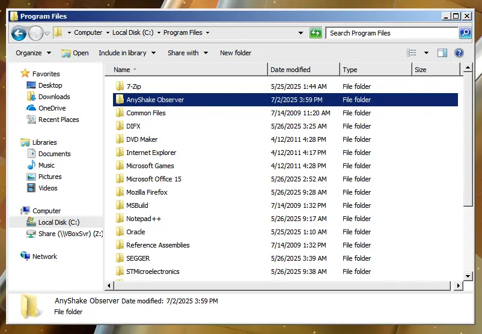
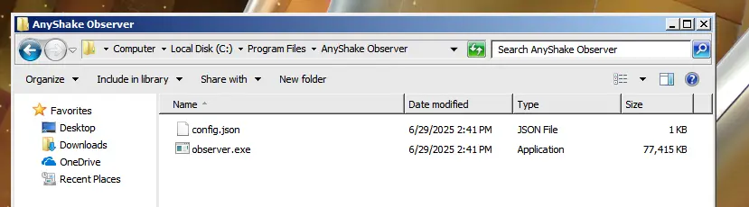

This section will guide you through the installation process for AnyShake Observer.

## Supported Platforms

AnyShake Observer runs on a wide range of platforms. Some architectures also support Docker images (highlighted in **bold**):

- **Android** (arm64)
- **macOS** (amd64 / arm64)
- **FreeBSD** (x86 / amd64 / arm / arm64)
- **Windows** 7 and later (x86 / amd64 / arm / arm64)
- **Linux** (**x86** / **amd64** / **arm** / **arm64** / **ppc64le** / **riscv64** / **s390x** / mips / mips64 / mips64le / mipsle / loong64)

In fact, AnyShake Observer can even run on a Raspberry Pi 1 Model B+ (overclocked to 950 MHz, with 100 MB of swap) with all core services enabled!

:::info
Although AnyShake Observer has very modest hardware requirements, we recommend using a system with **at least 1 GB of RAM** and a **dual-core CPU** for a smoother experience.
:::

## Installation Options

Depending on your platform and preferences, there are several ways to install AnyShake Observer. This section covers the most common and recommended method.

### Pre-Built Packages

This is the recommended installation method for most users. Pre-built packages are stable, easy to install, and require minimal configuration.

#### Download the Binary

Pre-built binaries are available on the GitHub Releases page of the AnyShake Observer repository:

Check out [github.com/anyshake/observer/releases](https://github.com/anyshake/observer/releases)

Each release includes assets named like:

- `windows_amd64.zip` – Windows 64-bit
- `linux_arm32_v7a.zip` – Linux ARM 32-bit
- `macos_arm64.zip` – macOS Apple Silicon

All pre-built packages are provided in `.zip` format. Download the one that matches your system, then unzip it to any directory.

You will also find `.dgst` files such as `linux_amd64.zip.dgst` – these contain MD5, SHA1, SHA2-256, and SHA2-512 digests for verifying file integrity.

#### Determine Your System Architecture

To find the correct binary, determine your system’s architecture:

**For Windows users:**

Open `cmd` and type:

```cmd
> echo %PROCESSOR_ARCHITECTURE%
```

- If you see `x86`, you’re on 32-bit Windows, use a package with `_386` suffix.
- If you see `AMD64`, you’re on 64-bit Windows, use a package with `_amd64` suffix.
- For Windows 7 users, use the package with `windows7_` prefix.

**For Linux users:**

Use this command:

```bash
$ uname -m
```

- If it returns `x86_64`, use the `_amd64` package.
- If it returns `i686`, use the `_386` package.
- For ARM devices like Raspberry Pi, it may return `armv7l`, `aarch64`, etc. Remember to choose the appropriate `linux_arm*` package accordingly.

#### Verify the Downloaded File

Each `.zip` file has a corresponding `.dgst` digest file. You can verify the integrity of the downloaded binary using:

```bash
$ cat linux_amd64.zip.dgst
MD5 = dd3a79d4baf00bcf09ad3b325d5d516b
...
$ echo "dd3a79d4baf00bcf09ad3b325d5d516b linux_amd64.zip" | md5sum -c
linux_amd64.zip: OK
```

Replace `linux_amd64.zip` and the hash with the appropriate filenames and values for your system.

#### Install the Binary

After extracting the ZIP package, you’ll find the following files:

- `observer.exe` – Windows executable
- `observer` – Linux/macOS executable
- `config.json` – Default configuration file
- `observer.service` – Linux systemd service file (optional)

:::tip
The default `config.json` may not be suitable for your system, so you need to edit it or generate a new one to override the default values before copying. We recommend using the **AnyShake Prisma** to generate a new configuration, see [Configuration Tool](configuration-tool) to learn more.
:::

**For Windows users:**

1. Create a directory, for example, `C:\Program Files\AnyShake Observer`.
   
2. Place `observer.exe` and `config.json` in the newly created directory.
   

**For Linux users:**

1. Add your user to the `dialout` group (for serial port access):

```bash
$ sudo usermod -a -G dialout $USER
```

2. Create the configuration directory and copy `config.json`:

```bash
$ sudo mkdir -p /usr/local/etc/observer
$ sudo cp config.json /usr/local/etc/observer/
```

3. Copy the binary to a system path:

```bash
$ sudo cp observer /usr/local/bin/
```

4. To verify the installation:

```bash
$ which observer
/usr/local/bin/observer
```

### Docker Image

If you prefer containers, an official Docker image is available.

:::info
The Docker installation method is **not recommended for Windows users**, as it is difficult to map serial devices properly.
:::

#### Pull the Image

```bash
$ docker pull ghcr.io/anyshake/observer:latest
```

#### Run the Container

Mount the config file and, if applicable, the serial port:

```
$ docker run -d \
    --name observer \
    --network host \
    --restart always \
    --device /dev/ttyUSB0:/dev/ttyUSB0 \
    --volume /path/to/config.json:/config.json \
    ghcr.io/anyshake/observer:latest \
    --config /config.json
```

- Replace `/path/to/config.json` with the actual path on your host
- Replace `/dev/ttyUSB0` with your actual serial port if applicable

If you don’t use a hardware serial connection, the `--device` flag is not needed.
