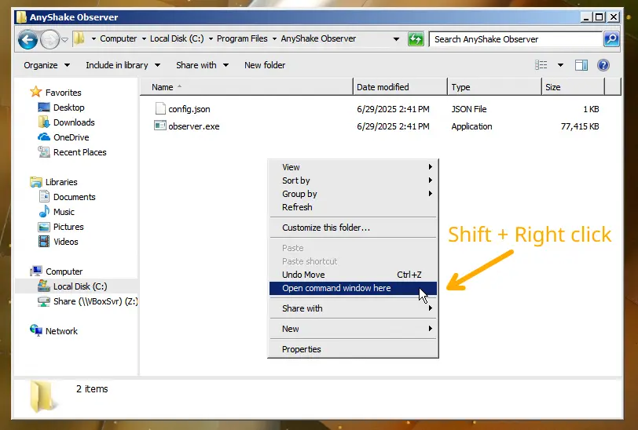
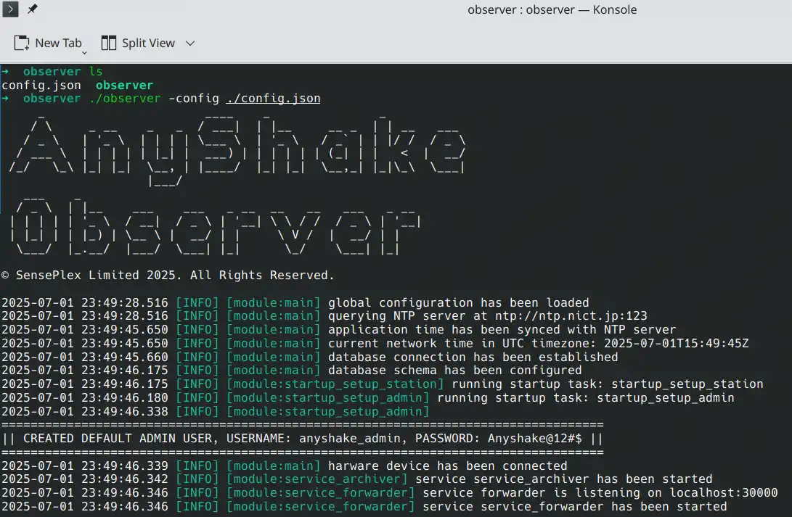
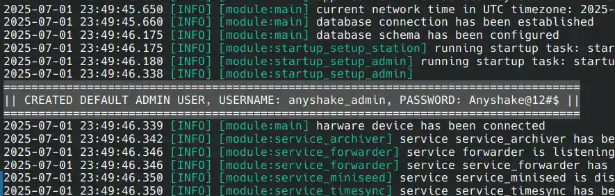
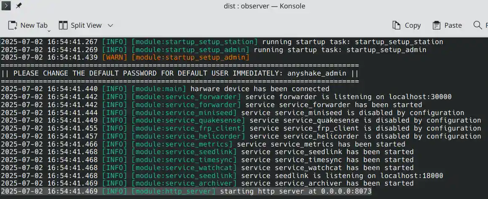
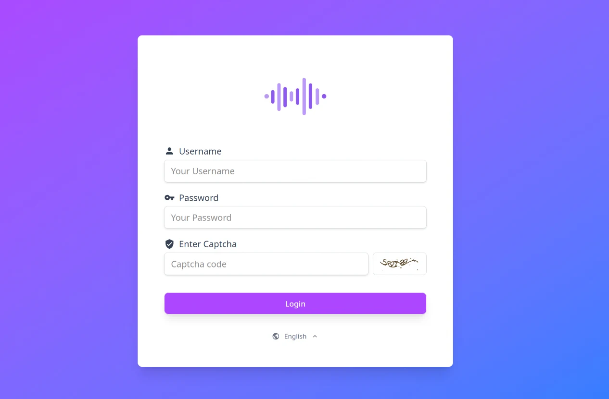
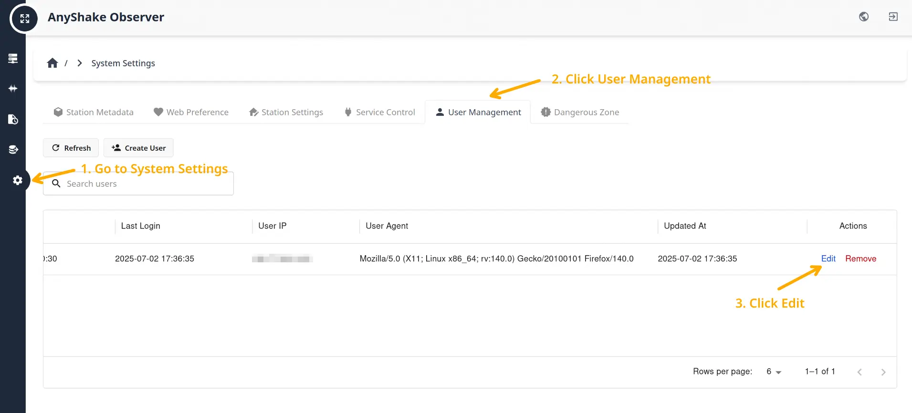
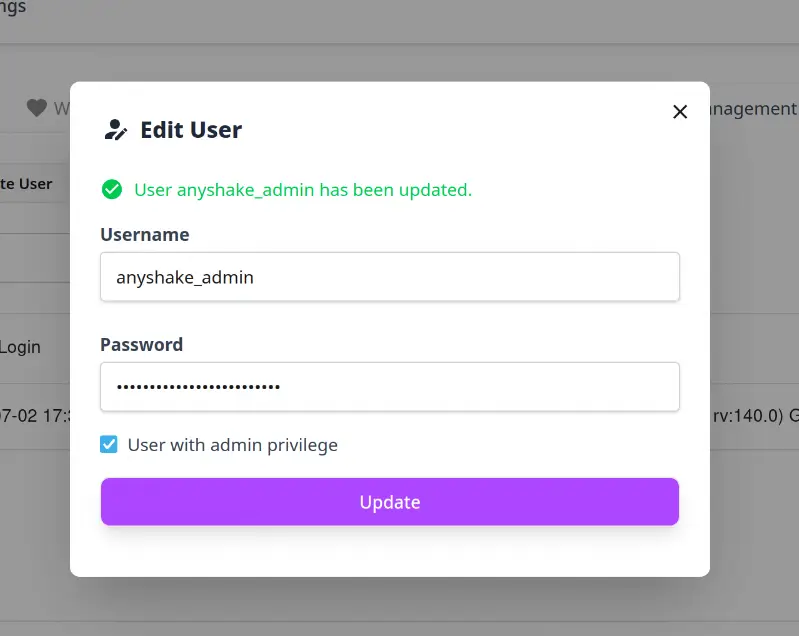
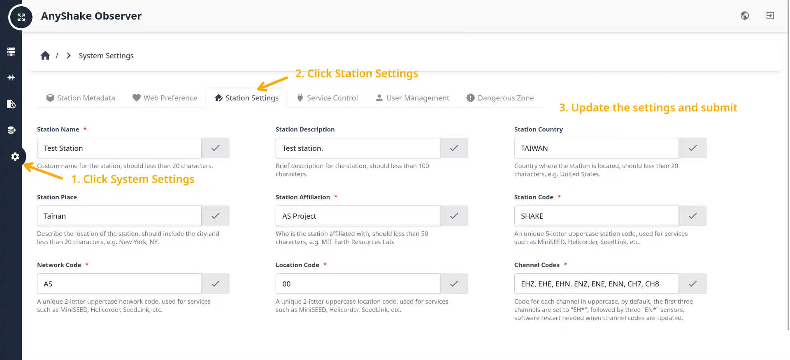
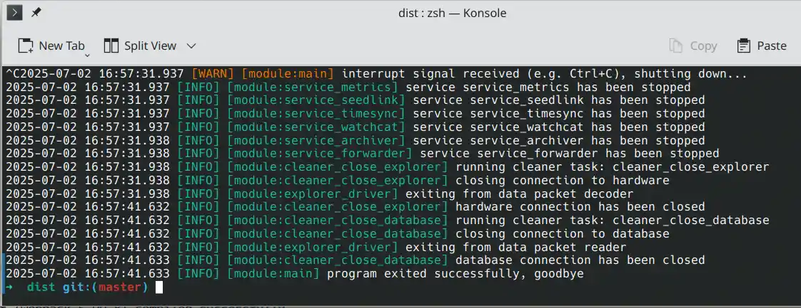

AnyShake Observer is a single-binary deployment, which means you can run it directly from the command line without additional dependencies.

After obtaining the `observer` binary and the `config.json` configuration file, you're ready to launch the application. This tutorial uses Debian Linux as an example. We assume that the `observer` binary has been installed to `/usr/local/bin`, and the configuration file is located at `/usr/local/etc/observer/config.json`.

For Windows users, you typically need to open Command Prompt or PowerShell from the installation directory. In this example, we assume `config.json` is located at `C:\Program Files\AnyShake Observer\config.json`.

To quickly open a command prompt in the desired folder on Windows, hold down Shift, right-click in the blank space of the folder, and select **“Open command window here”** (or **“Open PowerShell here”** on Windows 10 and later).



:::tip
On Windows, the executable is named `observer.exe`, while on Linux and macOS it is simply `observer`. The examples below use Linux/macOS syntax — Windows users should adjust accordingly.
:::

## Arguments

The `observer` binary accepts the following command-line arguments:

- `-version` – Display version information
- `-config` – Path to the configuration file

## Get Software Version

To display the version of the application, run:

```bash
$ /usr/local/bin/observer -version
```

This will output a banner along with version details, commit hash, build timestamp, Go toolchain version, and target architecture, similar to the following:

```
     _                      ____    _               _
    / \     _ __    _   _  / ___|  | |__     __ _  | | __   ___
   / _ \   | '_ \  | | | | \___ \  | '_ \   / _` | | |/ /  / _ \
  / ___ \  | | | | | |_| |  ___) | | | | | | (_| | |   <  |  __/
 /_/   \_\ |_| |_|  \__, | |____/  |_| |_|  \__,_| |_|\_\  \___|
                    |___/
   ___    _
  / _ \  | |__    ___    ___   _ __  __   __   ___   _ __
 | | | | | '_ \  / __|  / _ \ | '__| \ \ / /  / _ \ | '__|
 | |_| | | |_) | \__ \ |  __/ | |     \ V /  |  __/ | |
  \___/  |_.__/  |___/  \___| |_|      \_/    \___| |_|

© SensePlex Limited 2025. All Rights Reserved.

AnyShake Observer v4.0.3 (Listen to the whispering earth.)
Release: v4.0.3-dc746e0b-1751173006 go1.24.4 linux/amd64
```

## Run the Application

Before launching the application, make sure your AnyShake Explorer device is connected to the host. Then run the following command:

```bash
$ /usr/local/bin/observer -config /usr/local/etc/observer/config.json
```

If you are using Windows, you may need to adjust the path to the configuration file.

```powershell
C:\Program Files\AnyShake Observer>"C:\Program Files\AnyShake Observer\observer.exe" -config "C:\Program Files\AnyShake Observer\config.json"
```



On the first launch, the application may take some time to initialize the database — please be patient. Once the database is ready, the default administrator account will be created, and the initial login credentials will be printed to the console.



By default, the default administrator username is `anyshake_admin`, and the default password is `Anyshake@12#$`.

:::danger
Be sure to change the default administrator password after logging in for the first time!
:::

Once the application is running, the console will display the web access URL. By default, this is usually `http://127.0.0.1:8073`.



Open the web interface in your browser and log in using the default administrator credentials.



:::info
AnyShake Observer uses modern web technologies. Some older browsers may not be fully compatible, it may cause unexpected behavior (e.g. style issues).
:::

### Change the Default Administrator Password

After logging in for the first time, it's important to **change the default administrator password** to ensure system security.

1. Click the gear icon (⚙️ **System Settings**) in the left sidebar
2. Navigate to **User Management**
3. Click the **Edit** button next to the default administrator account



It's recommended to change the default username as well. This can be done in the same way as changing the password. The new password must meet the following requirements:

- Must be **8–32 characters** in length
- Include **at least one uppercase letter**
- Include **at least one special character**



:::tip
When editing the default administrator, the administrator itself cannot be downgraded.
:::

### Edit Station Settings

The station settings are global configuration that includes the following fields:

- Station Name
- Station Description
- Station Country
- Station Place
- Station Affiliation
- Station Code
- Network Code
- Location Code
- Channel Codes

These settings are used to identify your station, generate station metadata, filenames of MiniSEED archives, helicorder images. It can be edited at any time to meet your needs.



After editing, the settings will be fully applied after the next startup.

## Stop the Application

To safely stop the application, press Ctrl+C in the terminal. This will gracefully shut down the process, release hardware resources, and properly close the database. The shutdown procedure may take a few seconds — please wait until it completes.



:::info
Unless absolutely necessary, avoid using `kill -9 <PID>` to terminate the process, as this may prevent resources from being released properly and could result in data loss.
:::
