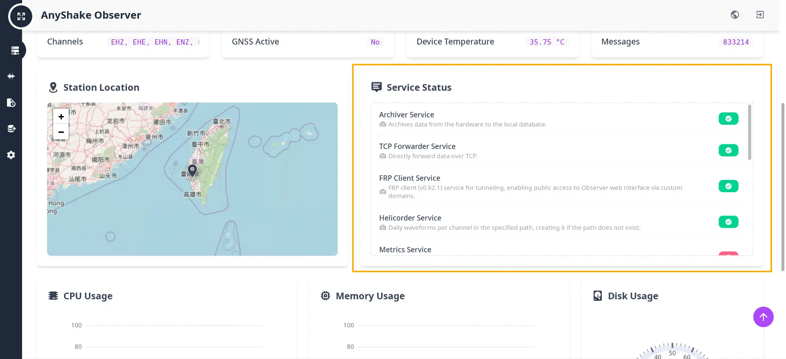

Service Modules are an integral part of AnyShake Observer. They are integrated into the system in a modular manner, operate independently of one another, and can be configured and managed dynamically.

At present, AnyShake Observer includes modules for MiniSEED archiving, a SeedLink server, earthquake triggers, and other functionality. All modules run locally and can be used in an offline environment.

Additional Service Modules are under active development, and community contributions are supported.

The **homepage** provides an overview of all available Service Modules and their current status.

Administrators can access the **Settings** page for further configuration.

This page provides information such as start and stop times, restart counts, configuration options, and access to logs. Modules can be restarted or reconfigured directly from this interface.

Most services are configurable and include documentation to support setup and operation. Compared with more complex frameworks such as SeisComP, the configuration process is simplified to ensure accessibility for both new and experienced users.

The following sections introduce each available Service Module, describe its functionality, and outline its usage.
