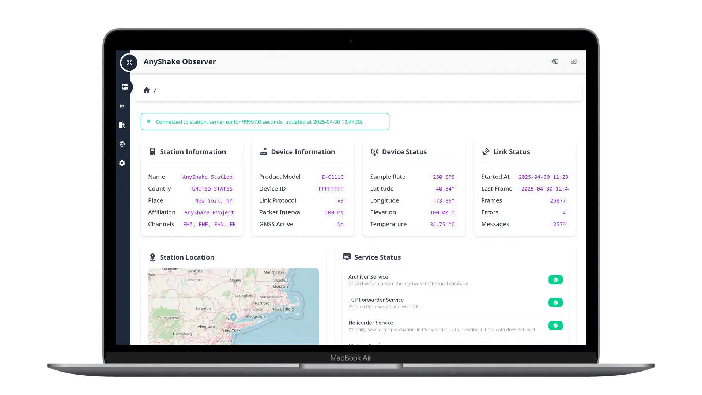
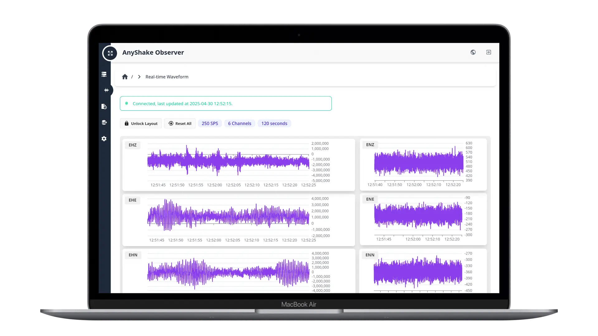
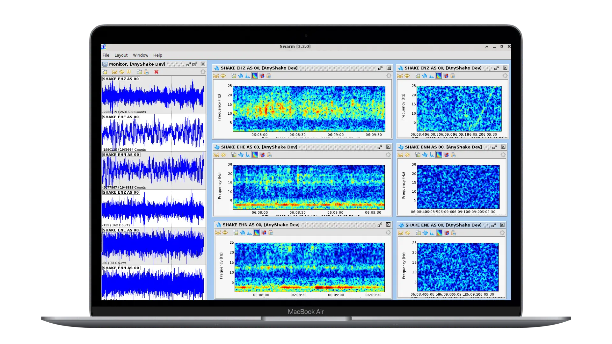
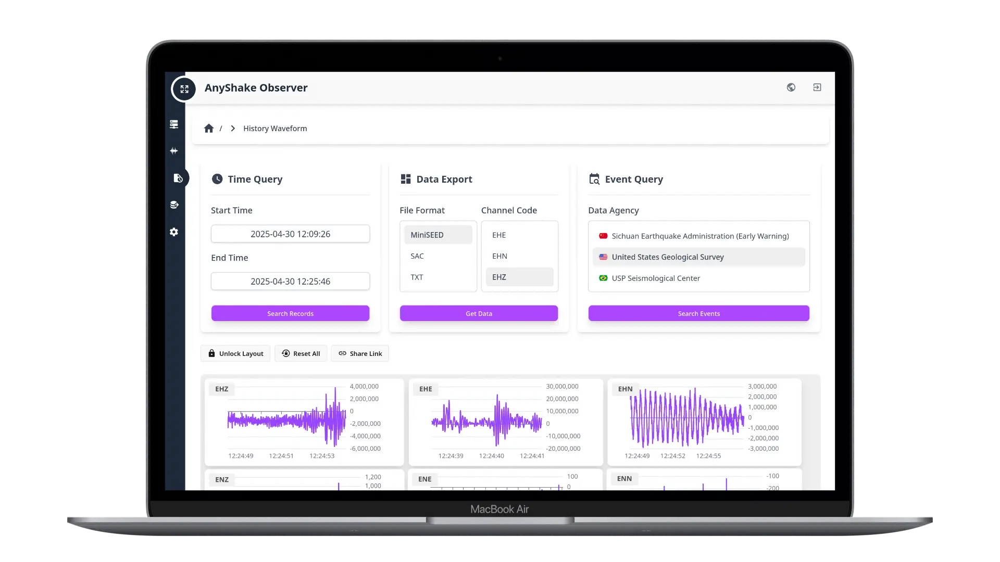
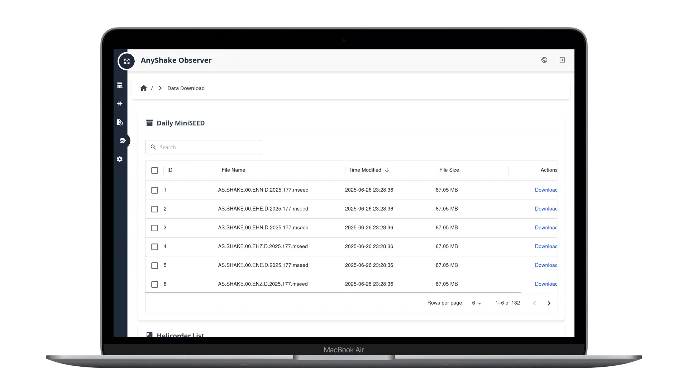
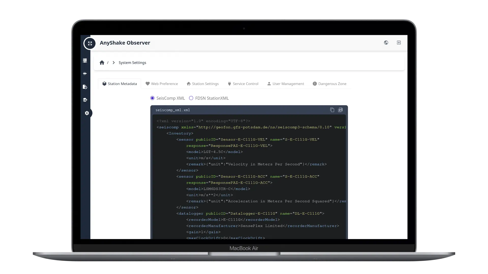
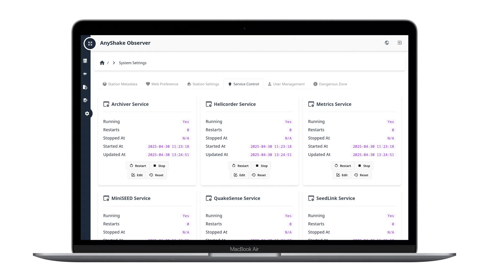
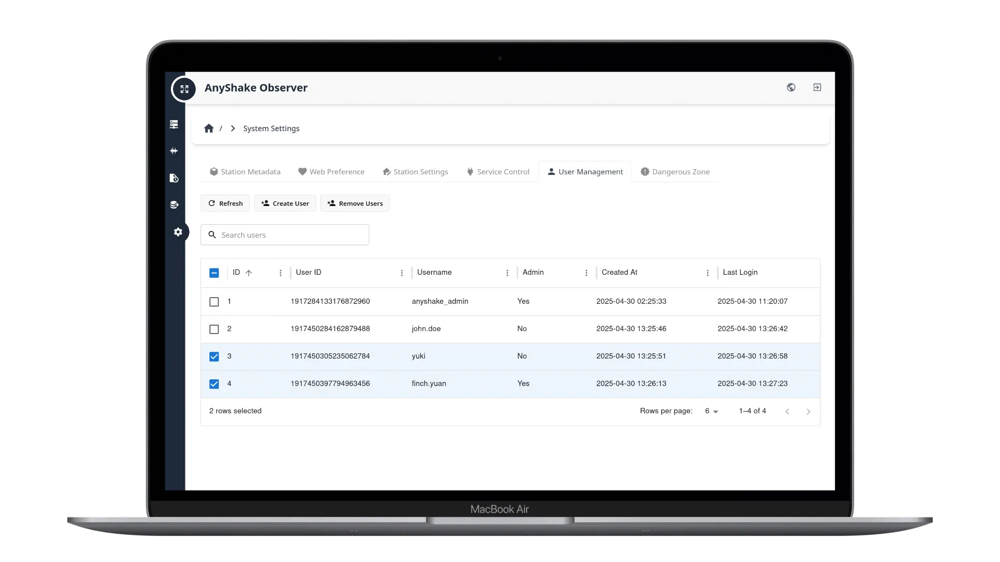

**AnyShake Observer** is the companion software for **AnyShake Explorer**, the world’s first fully open-source, high-precision seismic monitoring system. It is a cross-platform, web-based application designed to visualize, archive, and export seismic data in real time.

AnyShake Observer is written in **Go** and **TypeScript**, supporting a wide range of OS and CPU architectures, including embedded Linux. It offers real-time waveform display, event analysis, and database archiving, with a strong focus on professional usability and extensibility.

It works seamlessly with **AnyShake Explorer** over a serial connection and supports exporting data in standard seismic formats such as **SAC** and **MiniSEED**, as well as **SeedLink** streaming for networked data systems.

## Features

- **Single-binary deployment** – fast, simple, and cross-platform
- **Web-based user interface** – no client installation required
- **Responsive design** – optimized for desktop, tablet, and mobile
- **Multi-language support** – auto-detects browser language
- **Real-time waveform display** – view live seismic data from your device
- **Multi-channel support** – visualize multiple sensors (e.g. geophone and accelerometer)
- **Historical waveform queries** – search by time or global seismic events
- **Sharable waveform links** – share analysis results with a single URL
- **Daily helicorder generation** – auto-generated visual timeline of activity
- **QuakeSense service** – built-in earthquake detection engine (STA/LTA and Z-Detect methods)
- **Data export** – save data as **MiniSEED**, **SAC**, **TXT**, or **WAV**
- **Streaming & forwarding** – supports **SeedLink** and **TCP** protocols
- **Flexible storage** – compatible with PostgreSQL, MariaDB/MySQL, SQL Server, and SQLite
- **Seamless SeisComP integration** – easily connect to professional seismic networks

## Preview

Here are some screenshots showcasing the key features of **AnyShake Observer**.

### Home Dashboard

The Home Dashboard provides a concise overview of the station and device status, including current location, service module health, link connectivity, and real-time system statistics.

### Realtime Waveform

The real-time waveform view displays seismic data and the current sample rate from your AnyShake Explorer device in a web-based interface. It supports zooming, panning, and customizable channel layouts. Layout configurations are persistent and can be locked to prevent accidental changes.

### SeedLink Streaming

The AnyShake team independently developed a SeedLink protocol implementation in pure Go ([github.com/bclswl0827/slgo](https://github.com/bclswl0827/slgo)), enabling native SeedLink services without relying on RingServer or SeisComP. This allows seamless integration with tools like Swarm and ObsPy.

### Historical Data Query

The historical query feature lets users retrieve waveforms from the database by specifying a time range (up to 1 hour). It also integrates global seismic agency data for reverse earthquake lookup. Retrieved waveform parts can be exported in multiple formats, including MiniSEED, SAC, TXT, and WAV audio.

### Data Download

The Data Download page allows users to access and download daily archived MiniSEED files and helicorder images directly from disk for extended archiving or offline analysis.

### Station Metadata

Station metadata files for AnyShake Explorer devices — including instrument response (poles and zeros) are available in both SeisComP XML and FDSNWS StationXML formats. Users can easily copy the content to the clipboard or download it as a file.

### Service Control

A rich set of modular service modules are integrated, each running independently to ensure stability and flexibility. Users can enable, disable, or configure these modules directly through the web interface. The system also includes earthquake detection services using STA/LTA and Z-Detect algorithms (QuakeSense Service). Upon detecting seismic activity, it can push alerts in real time via MQTT protocol.

### User Management

The system supports both administrator and general user roles, making it adaptable for scenarios where multiple individuals manage and operate the site.

