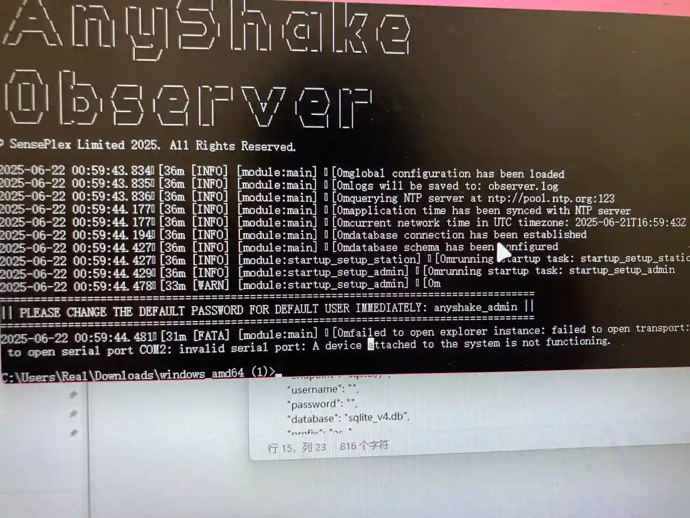
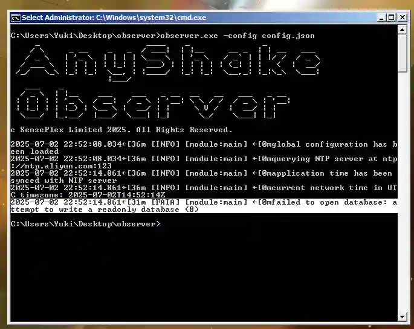
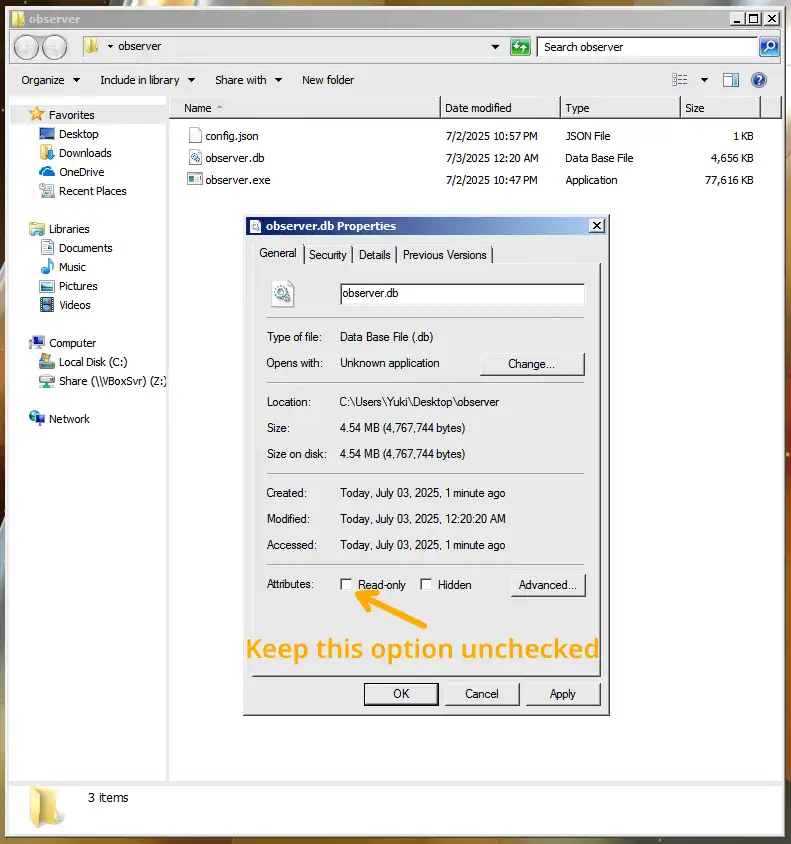

We summarized the common issues and solutions in the use of AnyShake Observer.

## I got error "A device attached to the system is not functioning" when starting



This is a common issue that only occurs on **Windows**, especially when using USB-to-Serial adapters based on the **CH340** chipset.

The problem is typically caused by **incompatible or unstable CH340 drivers** installed via Windows Update. To resolve this issue:

### Step 1: Roll back the CH340 driver

- Visit the Microsoft Update Catalog: [www.catalog.update.microsoft.com/Search.aspx?q=CH340](https://www.catalog.update.microsoft.com/Search.aspx?q=CH340)
- Download and install a driver dated **before 2014** (for example, **version 3.3.2011.11 from 2011** has proven to be stable in most cases).
- After installation, **please restart your computer**.

### Step 2: Block Windows from updating the driver again

To prevent Windows from overwriting the working driver:

1. Press `Win + R` to open the Run dialog, type `systempropertiesadvanced` to open the System Properties dialog.
2. Click the **Hardware** tab.
3. Click the **Device Installation Settings** button.
4. Choose **No, let me choose what to do** and click **Save Settings**.
5. Click **OK** to close the dialog.

## I got error "attempt to write a readonly database (8)" when starting



This error always occurs when insufficient permissions were granted to the database file.

To resolve this issue, on Linux systems, open the terminal and run the following command:

```bash
$ sudo chmod 666 /path/to/your/observer.db
$ sudo chown -R user:user /path/to/your/observer.db
```

Replace `user` with the username of the user who owns the database file.

On Windows systems, open the Properties dialog of the database file and remove the **Read-only** attribute.


