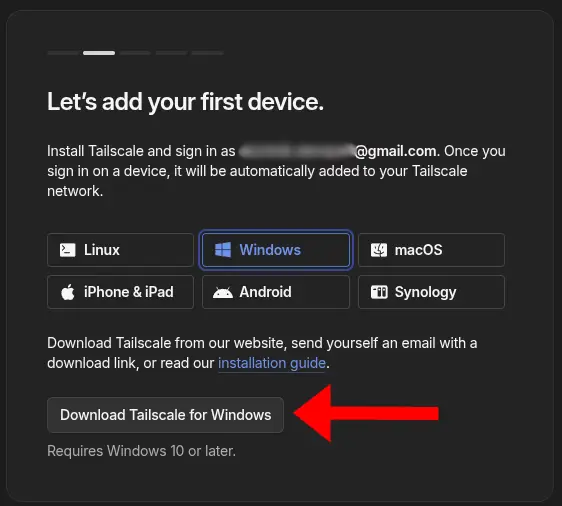
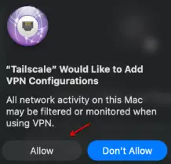
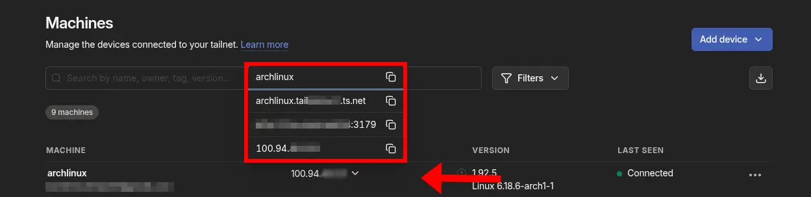

This section will guide you through the installation process of **Tailscale** and using it to access AnyShake Services.

## Overview

When accessing AnyShake services remotely, exposing ports directly to the public internet is not recommended due to security risk. A private VPN allows you to access services as if all your devices were on the same local network, without opening any ports to the outside world.

**Tailscale** is a mesh VPN built on top of **WireGuard** that creates a secure, encrypted network **tailnet** between your devices. Each device gets a private IP address, and traffic is end-to-end encrypted. This makes it well-suited for securely accessing self-hosted services such as AnyShake from anywhere.

While this guide uses **Tailscale** as an example, similar results can be achieved using other mesh VPN or private networking solutions, including:

- **ZeroTier** – Software-defined networking with virtual LANs
- **NetBird** – Open-source WireGuard-based mesh VPN
- **Headscale** – Self-hosted Tailscale control server
- **WireGuard (manual setup)** – Direct peer-to-peer VPN configuration

The choice of solution depends on your preferences and infrastructure. The steps below focus on **Tailscale** due to its ease of setup and broad platform support.

---

## Supported platforms

* **Android** (arm64)
* **iOS / iPadOS / tvOS** (arm64)
* **macOS** (amd64 / arm64)
* **Windows 7 and later** (x86 / amd64 / arm64)
* **Linux** (x86 / amd64 / arm / arm64 / ppc64le / riscv64 / s390x / mips / mips64 / mips64le / mipsle / loong64)
* **FreeBSD** (amd64 / arm64)
* **OpenWrt** (mips / mips64 / arm / arm64 / x86 / amd64)
* **Synology / QNAP / ASUSTOR NAS** (x86 / amd64 / arm / arm64)

## Create a tailnet
1. Go to [tailscale.com](https://tailscale.com/) and select **Get Started**.
2. On the **Sign up with your identity provider** page, log in using one of the available providers.
3. On the **Welcome to Tailscale** page, choose either **Business** or **Personal** use.
4. When prompted to add devices, follow the **Installation** instructions below to add at least two devices to your tailnet.
5. Once you reach the **Done! Your devices can now connect from anywhere** page, test the connection from one device using the `ping` command.  
   - If it works, your tailnet is ready.
   - If it doesn’t, click **Troubleshooting** and follow the official instructions.


:::info
If you sign up using a custom-owned domain, Tailscale automatically enrolls you in the **Enterprise** plan for a 14-day trial. If you sign up using a public domain email account like `@gmail.com`, Tailscale automatically enrolls you in the **Personal** plan, which allows 3 free users, 100 devices and many features from the **Enterprise** plan. For details go to [Modify billing](https://tailscale.com/kb/1182/billing-information).
:::

## Installation

### Downloading the binary
During the process of adding your 2 devices, you can directly download the binaries provided in the installation process, however if you already have a tailnet or your operating system is not on the list, you can directly download it from the [Tailscale Packages](https://pkgs.tailscale.com/stable/) page.

---

### For Linux users
To download **Tailscale** on a Linux device, you can simply execute the following command (alternatively you can directly download it from [Tailscale Packages](https://pkgs.tailscale.com/stable/)):
```bash
$ curl -fsSL https://tailscale.com/install.sh | sh
```

After that log in to start **Tailscale** using the command:
```bash
$ sudo tailscale up
```
This command will give you a link which you can simply open in your browser and log in.

:::tip
If you want **Tailscale** to automatically open on startup, execute the following command:
```bash
$ sudo systemctl enable tailscaled
```
:::

:::info
If you want to run **Tailscale** in userspace mode start it using the following command:
```bash
$ sudo tailscaled --tun=userspace-networking
```
:::

### For Windows users
To download **Tailscale** on a Windows device, you have to download the binary either provided in the sign up process or from [Tailscale Packages](https://pkgs.tailscale.com/stable/)



Open the file, check `I agree to the license terms and conditions` and click **Install**.

Once you're in the **Welcome to Tailscale** page, click `Get Started`.
After that, the app should open the **Join your network** page, where you have a button `Sign in to your network`, clicking that button should open a **Sign in** page in your browser.

After signing in you should see a text `Login successful`.

### For macOS users
To download **Tailscale** on a macOS device, you can download it from **Mac App Store** or from [Tailscale Packages](https://pkgs.tailscale.com/stable/) or from the binary given during the sign up process.


If you didn't install it from **Mac App Store** open the file, and follow the displayed installation instructions, after that a new app called **Tailscale** should be installed on your device.

Once you're in the **Welcome to Tailscale** page, click `Get Started`.

:::tip
The app may ask for permission to **Allow VPN configuration**, if that happens allow it.

:::

After that, the app should open the **Join your network** page, where you have a button `Sign in to your network`, clicking that button should open a **Sign in** page in your browser.

After signing in you should see a text `Login successful`.
It may also ask whether you want to start it on log in, if you do want it to start it on log in automatically click `Yes, start on log in`, otherwise click `No I will manually start Tailscale`.


---

After installation you should be able to access any service exposed to your LAN or directly to the **Tailscale** IP address via the IP address given to your device on **Tailscale**.

## Finding the IP of your device

You can find the IPs/urls with which you can access your device in the [Online Tailscale Admin Dashboard](https://login.tailscale.com/admin/machines).



## Remotely accessing AnyShake services

After the whole process is done, anything exposed to `0.0.0.0` or the IP of your device given in the **Tailscale** dashboard, will be accessible through any connected device.

For example, if AnyShake is running on `0.0.0.0:8080`. You can access it remotely using `<tailscale-ip>:8080` or the device’s MagicDNS name (ex. raspberrypi)
