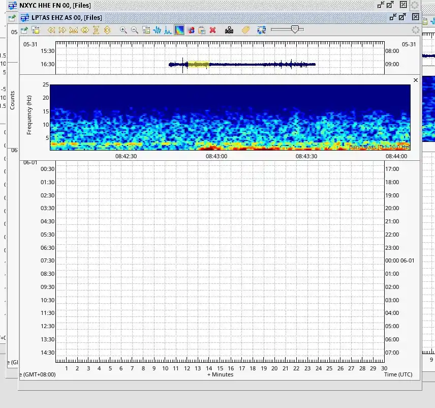
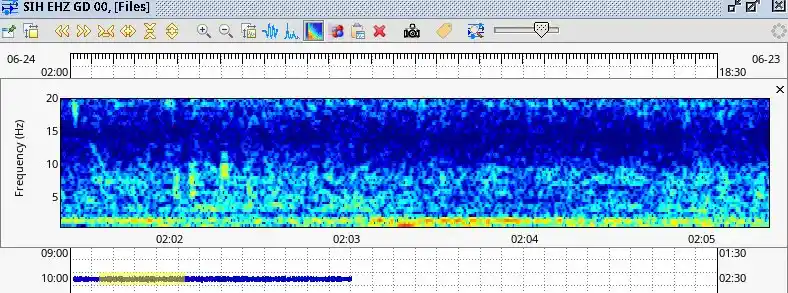
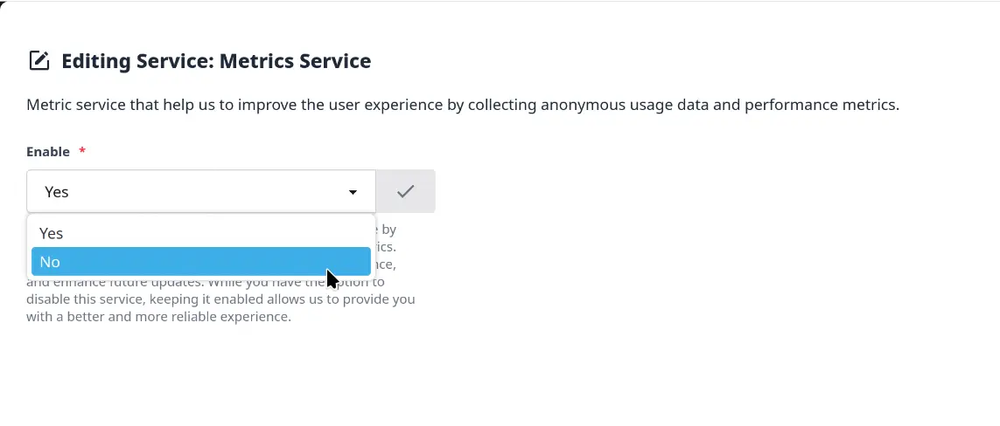
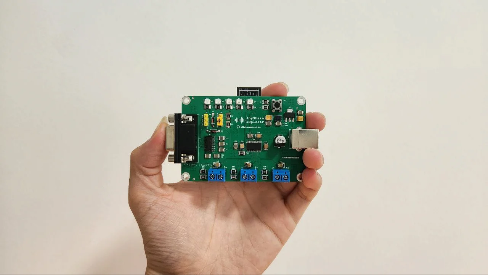

## Is AnyShake Project suitable for scientific research?

Yes. The system has been successfully used in academic settings, seismic education, and structural monitoring. It is especially valuable for projects that require:

- High-resolution ground motion data
- Open access to algorithms and firmware
- Portable or field-deployable instrumentation

We welcome community contributions and academic collaborations.

---

## Is AnyShake a clone of Raspberry Shake or similar products?

No. **AnyShake Project is absolutely not a clone** of Raspberry Shake or any other commercial seismograph. While both products share similar goals — making seismic monitoring more accessible — **AnyShake is an original, fully open-source project** developed from scratch, both in hardware and software.

Key differences include:

- **Open-source hardware**: All schematics and PCB layouts are available for anyone to review, modify, or reproduce.
- **Independent firmware and DSP pipeline**: Our signal acquisition, filtering, and compensation algorithms are custom designed and not derived from proprietary implementations.
- **Custom software platform**: AnyShake Observer is a native, cross-platform application designed specifically for this hardware — not based on CAPS, OSOP Wave Server, heli_ewII or other legacy tools.

While we acknowledge the success of Raspberry Shake in popularizing personal seismographs, **AnyShake Project is an independent effort**, aimed at pushing the limits of openness, accuracy, and customization for developers, researchers, and educators.

---

## Is AnyShake Project suitable for commercial use?

Yes, but please contact us before using the device in a commercial setting. AnyShake Project is designed with flexibility in mind, but **commercial applications** (e.g., in industrial monitoring, engineering consultancy, or product integration) may require:

- Licensing clarification
- Customization or hardware adaptation
- Volume procurement and support agreements
- Regulatory compliance advice

Please email us at **anyshake@senseplex.net** to discuss your commercial use case.

---

## Can I detect distant earthquakes (teleseismic events) with AnyShake?

Yes. With proper installation in a **low-noise environment** and solid mechanical coupling, **AnyShake Explorer is capable of detecting teleseismic events**, particularly those with a **magnitude of 6.0 or higher**. The device features high-quality analog geophones with excellent signal-to-noise ratio and employs **low-frequency compensation algorithms** to extend the usable frequency range, significantly improving sensitivity to long-period seismic waves.

The following example shows a **magnitude 6.0 earthquake** that occurred **[off the coast of Kushiro, Hokkaido, Japan](https://earthquake.usgs.gov/earthquakes/eventpage/us6000qh1r/executive)** on **May 31, 2025**, recorded by an **AnyShake Explorer E-C111G unit** located approximately **2,500 km away**.

Our earlier-generation model, the **E-D001**, also performs remarkably well in detecting teleseismic events, despite being a simpler design. It uses a firmware-level low-frequency compensation algorithm to enhance low-frequency sensitivity.

The figure below shows a **magnitude 6.2 earthquake** that struck the **[Philippines](https://earthquake.usgs.gov/earthquakes/eventpage/us7000q8bd/executive)** on **June 24, 2025**, recorded by an **AnyShake Explorer E-D001 unit** from a distance of approximately **2,500 km**.

---

## Is my data shared to the internet?

**AnyShake Observer does not upload waveform data by default.** Your seismic recordings, including raw waveforms and processed signals, are stored and processed **locally**, and are **not transmitted to the internet** unless you explicitly choose to share them.

However, for diagnostic and maintenance purposes, **telemetry data** are periodically sent to our servers, such as:

- System health status (e.g., uptime, data link status)
- Device serial number
- Platform information
- Software version

These data helps us monitor system stability, detect bugs, and plan future updates.

:::tip
You can permanently turn off telemetry at any time by disabling "Metrics Service" in AnyShake Observer web interface.

:::

---

## What about contributing to a global seismic network?

At present, **AnyShake does not maintain its own centralized seismic network**. Our current focus is on helping users **connect their devices to existing seismic infrastructure**, such as:

- Institutional SeisComP networks
- Custom data servers
- Educational monitoring systems

In the future, we plan to introduce an **open, decentralized seismic network** — opt-in only — where users can contribute data under their own terms using peer-to-peer protocols or trusted hubs.

:::info
We believe in empowering users to choose whether and how they contribute to the global understanding of seismic activity — without compromising privacy or autonomy.
:::

---

## Can I build my own from scratch?

Yes! AnyShake Project is **fully open-source and reproducible**. You can build your own version using:

- Hardware PCB design files
- Firmware source code
- Software source code
- Example projects and instructions

Many community users have successfully replicated the project.

:::info
Unfortunately, we are unable to offer technical support for DIY users independently at this time. Please refer to our [technical support policy](/docs/support-policy#for-diy-users) for more information.
:::

---

## I'm on a tight budget — is there a way to quickly evaluate this project?

Yes. If you're working with a limited budget but would like to explore what AnyShake offers, we recommend trying out **our earlier-generation model: E-D001**.

E-D001 is a simpler and more affordable version of AnyShake Explorer. It can reach a **instrument period of ~1.25 seconds (~0.8 Hz)** and retains around **40% of the signal quality** and functionality of the Explorer model, while being:

- **Extremely low cost**: less than $40 for the core board (PCB manufacturing costs included)
- **Much easier to build**: perfect for geeks and hobbyists
- **Fewer components**, simpler circuitry
- **Large solder pads** and **minimal soldering points**
- **Compact PCB size** and single-layer design
- **More tolerant to hand-assembly mistakes**
- Requires only basic tools (no hot air or reflow oven)

We provide open-source documentation, schematics, PCB layouts and firmware for E-D001 as well. Many users have successfully built this model as an entry point into the world of seismic sensing.

Check out [E-D001](https://github.com/anyshake/explorer/tree/v1) for more details.

:::info
E-D001 is ideal for learning, prototyping, or classroom demonstrations, **but may not meet the sensitivity, timing, or frequency response requirements of more advanced applications**.
:::

---

## How do I report bugs?

For general issues, please file them in the appropriate GitHub repository according to the module involved. For example:

- If you discover a crash while using **AnyShake Explorer**, open an issue at [GitHub > explorer > Issues](https://github.com/anyshake/explorer/issues)
- If you experience problems using the **AnyShake Nexus** plugin with SeisComP, open an issue at [GitHub > nexus > Issues](https://github.com/anyshake/nexus/issues)

For **serious issues** such as **security vulnerabilities**, please do **not** publish them publicly. Instead, email us directly at [anyshake@senseplex.net](mailto:anyshake@senseplex.net) to avoid potential exploitation or malicious attacks before a fix can be issued.

---

## Can I get involved or contribute?

Absolutely! We welcome contributions across the board:

- Software development (features, fixes, visualization, etc.)
- Firmware improvements (signal processing, filtering)
- Hardware enhancements or adaptations
- Documentation (translation, correction, expansion)

Please email us at [anyshake@senseplex.net](mailto:anyshake@senseplex.net) to discuss your interest in contributing.
