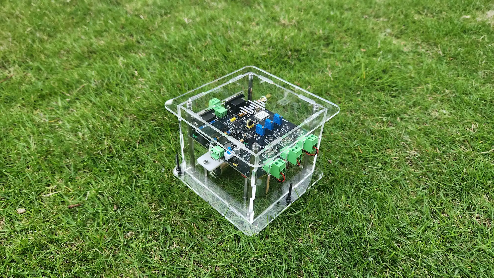

## What is AnyShake?

AnyShake is an open-source, professional-grade seismic monitoring system designed for **researchers**, **engineers**, **educators**, and **enthusiasts**. By providing high-sensitivity, 3-axis geophones coupled with advanced electronics and software, **AnyShake Explorer** delivers affordable, high-precision seismic monitoring that rivals proprietary systems. Paired with **AnyShake Observer**, it offers real-time data visualization, analysis, and export capabilities.

Unlike traditional seismographs, which are often proprietary and expensive, AnyShake offers a solution that is fully open-source, providing anyone with access to high-fidelity seismic data. Whether for earthquake research, structural health monitoring, or general seismic data collection, AnyShake serves a wide range of applications.

## How AnyShake Works

**AnyShake Explorer** captures seismic data using three high-sensitivity **velocity geophones** and **3-axis accelerometers**. These geophone sensors measure seismic waves in three directions (EHZ, EHE, EHN) and convert the motion of seismic waves into electrical signals, which are then transmitted to the companion software, **AnyShake Observer**, for real-time monitoring and analysis.

**AnyShake Observer** is a cross-platform, web-based application that processes the seismic data and provides users with a real-time waveform display, historical data query capabilities, and a powerful earthquake detection engine.

### Key Features of AnyShake Explorer:

- **3-Axis Geophone + 3-Axis Accelerometer Sensors**: Provides precise, high-sensitivity data for seismic event detection in all three directions (vertical and horizontal axes).
- **32-Bit ADC**: Ensures ultra-low noise data capture, offering the highest accuracy possible.
- **Flexible Sampling Modes**: Supports a wide range of sampling modes, including geophone-only, accelerometer-only, and simultaneous 6-channel sampling (3-axis geophones + 3-axis accelerometers).
- **Real-Time Data Transmission**: Communicates through RS-232/RS-485 serial interfaces for smooth and reliable data transmission.
- **Time Synchronization**: Supports GNSS/NTP synchronization for millisecond-level precision.
- **Low Power Operation**: Consumes only \~0.6W, ideal for long-term deployment in remote or off-grid locations.
- **Open-Source Hardware and Software**: Full access to hardware schematics, firmware, and software, allowing customization and development.

### Key Features of AnyShake Observer:

- **Web-Based Interface**: No installation required; simply access through any modern browser on desktop, tablet, or mobile.
- **Real-Time Waveform Display**: View live seismic data in real-time with zooming, panning, and customizable channel layouts.
- **Multi-Channel Support**: Visualize data from multiple sensors, including both geophones and accelerometers.
- **Historical Data Query**: Access past seismic data and filter it by time or global seismic events.
- **Data Export**: Export seismic data in popular formats such as **MiniSEED**, **SAC**, **TXT**, and **WAV** for further analysis.
- **Earthquake Detection Engine**: The built-in **QuakeSense** service detects earthquakes using STA/LTA and Z-Detect algorithms, automatically sending alerts via MQTT.
- **Flexible Storage and Integration**: Supports multiple database backends (PostgreSQL, MySQL, SQLite) and integrates seamlessly with seismic tools like **SeisComP**.
- **Seamless Integration with Professional Seismic Networks**: Easily connect to professional seismic networks for a broader scope of data.

## Setting Up AnyShake

### 1. Hardware Setup:

- **AnyShake Explorer** includes everything needed for seismic monitoring: three high-sensitivity geophones, a 3-axis accelerometer, and an OLED display for system status.
- **Powering the Device**: The Explorer operates on a low-power 9–12V DC power source (\~50mA), making it perfect for solar-powered or battery-operated systems.

### 2. Software Setup:

- **AnyShake Observer** is available as a single binary for easy cross-platform deployment. It doesn’t require client installation and works directly through any modern browser.
- **Installation**: Simply follow the quick-start guide on the official documentation page. The software works on **Linux**, **macOS**, **Windows**, and even **embedded Linux** devices.

### 3. Connecting Hardware and Software:

- Once the **AnyShake Explorer** is powered on, it will start transmitting data through its serial ports to **AnyShake Observer**.
- Use the **AnyShake Observer** web interface to configure, monitor, and analyze real-time data. You can also access historical data and export it in standard seismic formats.

## Comparison with Competitors

| **Feature**              | **AnyShake Explorer** | **Raspberry Shake 1D** | **Raspberry Shake 4D** | **Raspberry Shake 3D** |
| ------------------------ | --------------------- | ---------------------- | ---------------------- | ---------------------- |
| **Open-Source Hardware** | ✅                    | ❌                     | ❌                     | ❌                     |
| **Open-Source Software** | ✅                    | Partial                | Partial                | Partial                |
| **Geophone Channels**    | 3                     | 1                      | 1                      | 3                      |
| **Accelerometer**        | 3-axis                | ❌                     | 3-axis                 | ❌                     |
| **ADC Resolution**       | 32-bit                | 24-bit                 | 24-bit                 | 24-bit                 |
| **Sampling Rate**        | 50–250 SPS            | 100 SPS                | 100 SPS                | 100 SPS                |
| **Baud Rate**            | 57,600–460,800 bps    | 57,600 bps             | 57,600 bps             | 57,600 bps             |
| **Power Usage**          | \~0.6W                | \~2.2W                 | \~2.2W                 | \~2.2W                 |
| **Customizability**      | ✅                    | ❌                     | ❌                     | ❌                     |
| **Data Export Formats**  | MiniSEED, SAC, WAV    | MiniSEED               | MiniSEED               | MiniSEED               |
| **Real-Time Display**    | ✅                    | ❌                     | ❌                     | ✅                     |
| **Time Synchronization** | GNSS & NTP            | ❌                     | ❌                     | ❌                     |
| **Streaming Protocols**  | SeedLink, TCP         | ❌                     | ❌                     | ❌                     |

## Why Choose AnyShake?

- **Affordability**: While proprietary systems often cost thousands of dollars, **AnyShake** delivers high-resolution, professional-grade seismic data at a fraction of the cost.
- **Transparency and Customization**: With full access to hardware schematics, firmware, and software, **AnyShake** is entirely open-source, enabling modifications and extensions based on user needs.
- **Real-Time Data and Analysis**: Unlike competitors, **AnyShake** provides real-time waveform display, data streaming, and earthquake detection services.
- **Low-Frequency Compensation**: **AnyShake** successfully implements low-frequency compensation, extending the frequency limit to a 2-second period (0.5 Hz), offering unique monitoring capabilities not found in other open-source systems.
- **Community-Driven**: As an open-source project, **AnyShake** benefits from a growing community that actively contributes to its improvement, ensuring new features and bug fixes are regularly integrated.
