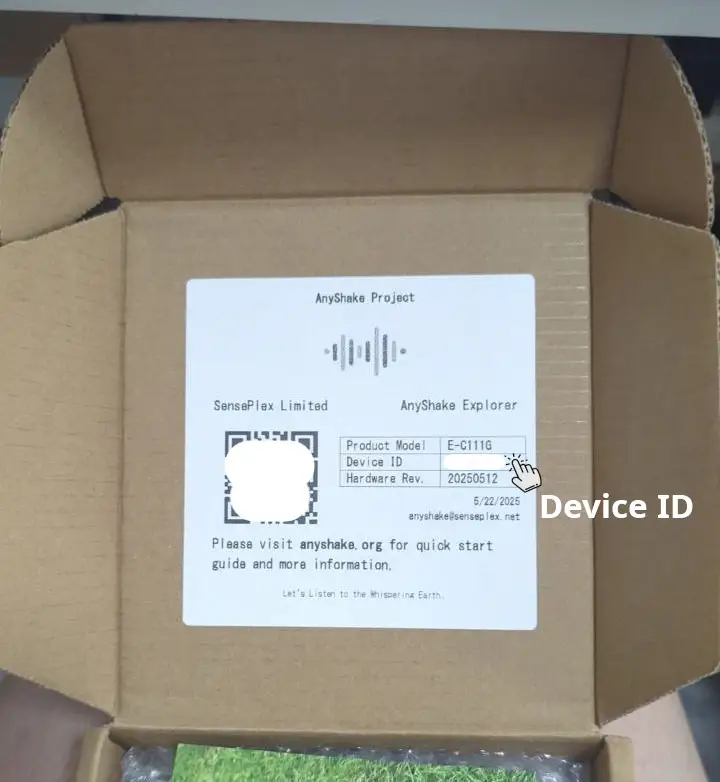
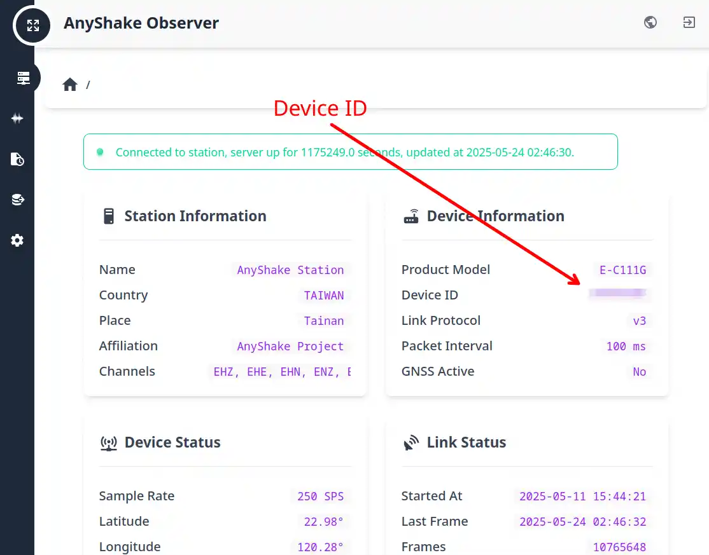
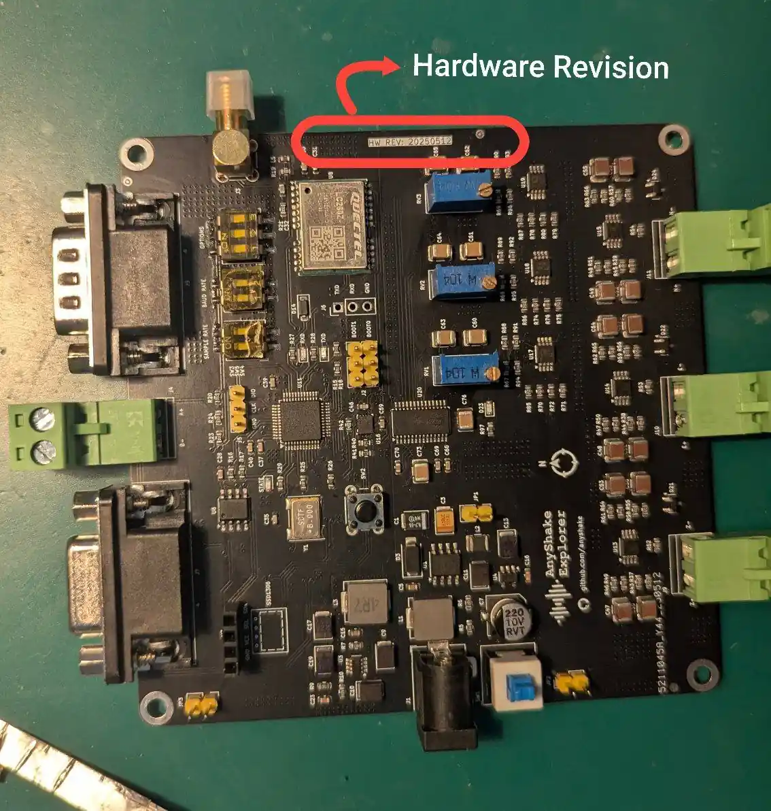
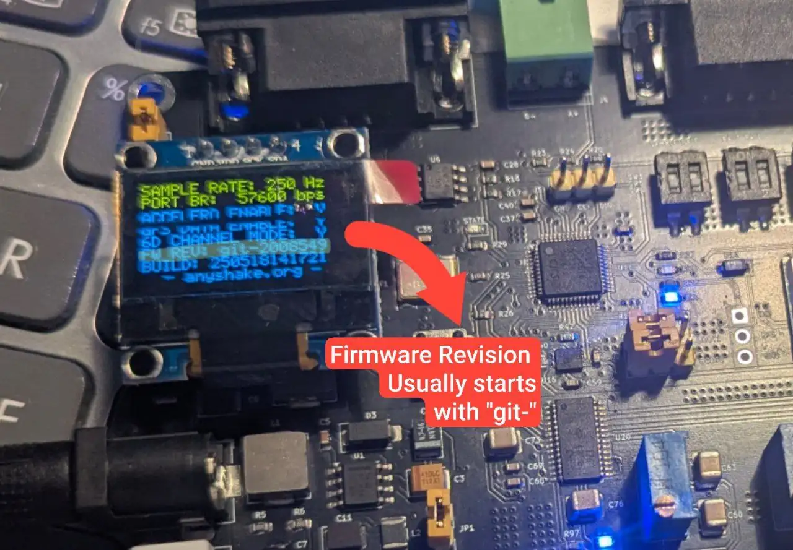

Due to limited team capacity, the AnyShake team adopts a tiered technical support policy based on user type and request nature, we appreciate your understanding.

## For DIY Users

We are committed to maintaining a fully open-source ecosystem and have released all relevant hardware and software resources. However, **we are unable to provide technical support for self-assembled (DIY) units**, including but not limited to the following inquiries:

- Questions about selecting components based on the BOM (e.g., choosing between multiple variants of a chip).
- Troubleshooting assembly issues (e.g., the device fails to start, incorrect waveforms, excessive noise).
- Questions regarding sourcing or purchasing of individual parts.

We recommend that DIY users refer to our official documentation, GitHub repositories, and community discussions for guidance.

## For Our Customers

We provide **one-on-one technical support via email** to users who have purchased the official AnyShake Explorer hardware. This support covers the following scenarios:

- Issues encountered during installation or operation of the hardware (e.g., missing calibration data, device not functioning as expected, unexpected noise or signal interference).
- Inquiries related to firmware behavior, hardware configuration, and embedded systems integration.
- Problems encountered during software deployment — such as installation failures, runtime issues, or software not functioning as expected in your environment.
- Customization requests, including minor feature modifications or inquiries about the suitability of the solution for specific applications.

:::info
In cases involving software deployment or configuration, we may also offer **remote technical support** when necessary to help resolve the issue more efficiently.
:::

To initiate support, please contact us at: **[anyshake@senseplex.net](mailto:anyshake@senseplex.net)**. When requesting support, please provide the following information:

- **Device ID** – A unique identifier for your device, it can be found:
    - On the packaging box.
      
    - Displayed in the **AnyShake Observer** web UI.
      
- **Hardware Revision** – Date that indicates current hardware revision, it can be found:
    - On the packaging box.
    - On front side of PCB.
      
- **Firmware Revision** - Git commit hash that indicates current firmware revision, it can be found:
    - On OLED display.
      

:::danger Caution
The Device ID acts as a support pin and uniquely identifies your unit. **Please keep it confidential**. We may not respond to support emails lacking valid device identification.
:::

## For Software Users

We welcome all users — regardless of hardware purchase status — to participate in the development and improvement of our software.

For issues related to AnyShake software (e.g., feature requests, bug reports, UI questions), or for general feedback, please use our GitHub issue trackers, such as:

- **AnyShake Observer (software/visualization):**  
  [github.com/anyshake/observer/issues](https://github.com/anyshake/observer/issues)
- **AnyShake Nexus (SeisComP plugin):**  
  [github.com/anyshake/nexus/issues](https://github.com/anyshake/nexus/issues)
- **AnyShake Prisma (configuration tool):**  
  [github.com/anyshake/prisma/issues](https://github.com/anyshake/prisma/issues)

Please make sure to select the correct repository based on the topic of your issue.
